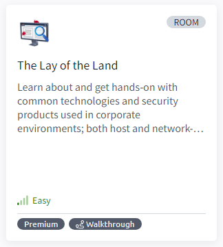

# The Lay of the Land

Learn about and get hands-on with common technologies and security products used in corporate environments; both host and network-based security solutions are covered.

## Task 1 - Introduction

## Task 2 - Deploy the VM

## Task 3 - Network Infrastructure

## Task 4 - Active Directory (AD) environment

## Task 5 - Users and Groups Management

## Task 6 - Host Security Solution #1

## Task 7 - Host Security Solution #2

## Task 8 - Network Security Solutions

## Task 9 - Applications and Services

## Task 10 - Conclusion