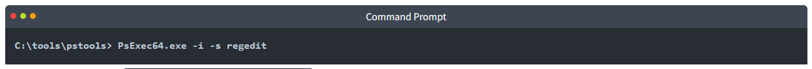

# [Windows Local Persistence](https://tryhackme.com/r/room/windowslocalpersistence)


## Task 1 - Introduction


After gaining the first foothold on your target's internal network, you'll want to ensure you don't lose access to it before actually getting to the crown jewels. Establishing persistence is one of the first tasks we'll have as attackers when gaining access to a network. In simple terms, persistence refers to creating alternate ways to regain access to a host without going through the exploitation phase all over again.
Backdoored Phone


There are many reasons why you'd want to establish persistence as quick as possible, including:

* **Re-exploitation isn't always possible**: Some unstable exploits might kill the vulnerable process during exploitation, getting you a single shot at some of them.
* **Gaining a foothold is hard to reproduce**: For example, if you used a phishing campaign to get your first access, repeating it to regain access to a host is simply too much work. Your second campaign might also not be as effective, leaving you with no access to the network.
* **The blue team is after you**: Any vulnerability used to gain your first access might be patched if your actions get detected. You are in a race against the clock!

While you could do with keeping some administrator's password hash and reusing it to connect back, you always risk those credentials getting rotated at some point. Plus, there are sneakier ways in which you could regain access to a compromised machine, making life harder for the blue team.

In this room, we'll look at the most common techniques attackers use to establish persistence in Windows systems. Before going into this room, it is recommended to be familiar with Windows systems fundamentals. You can check rooms on the matter in the following links:

* [Windows Fundamentals 1](https://tryhackme.com/room/windowsfundamentals1xbx)
* [Windows Fundamentals 2](https://tryhackme.com/room/windowsfundamentals2x0x)

Powershell is also used extensively throughout this room. You can learn more about it in the [Hacking with Powershell](https://tryhackme.com/room/powershell) room.

### Answer the questions below

* Click and continue learning!

## Task 2 - Tampering With Unprivileged Accounts

Having an administrator's credential would be the easiest way to achieve persistence in a machine. However, to make it harder for the blue team to detect us, we can manipulate unprivileged users, which usually won't be monitored as much as administrators, and grant them administrative privileges somehow.

Click the **Start Machine** button on this task before continuing. The machine will be available on your web browser, but if you prefer connecting via RDP, you can use the following credentials:


**Note**: When you log in via RDP, the existing in-browser view will be disconnected. After you terminate your RDP session you can get the in-browser view back by pressing **Reconnect**.

Notice that we assume you have already gained administrative access somehow and are trying to establish persistence from there.

### Assign Group Memberships

For this part of the task, we will assume you have dumped the password hashes of the victim machine and successfully cracked the passwords for the unprivileged accounts in use.

The direct way to make an unprivileged user gain administrative privileges is to make it part of the **Administrators** group. We can easily achieve this with the following command:

```
net localgroup administrators thmuser0 /add
```


This will allow you to access the server by using RDP, WinRM or any other remote administration service available.

If this looks too suspicious, you can use the **Backup Operators** group. Users in this group won't have administrative privileges but will be allowed to read/write any file or registry key on the system, ignoring any configured DACL. This would allow us to copy the content of the SAM and SYSTEM registry hives, which we can then use to recover the password hashes for all the users, enabling us to escalate to any administrative account trivially.

To do so, we begin by adding the account to the Backup Operators group:

```
net localgroup "Backup Operators" thmuser1 /add
```


Since this is an unprivileged account, it cannot RDP or WinRM back to the machine unless we add it to the **Remote Desktop Users** (RDP) or **Remote Management Users** (WinRM) groups. We'll use WinRM for this task:

```
net localgroup "Remote Management Users" thmuser1 /add
```


We'll assume we have already dumped the credentials on the server and have thmuser1's password. Let's connect via WinRM using its credentials:


If you tried to connect right now from your attacker machine, you'd be surprised to see that even if you are on the Backups Operators group, you wouldn't be able to access all files as expected. A quick check on our assigned groups would indicate that we are a part of Backup Operators, but the group is disabled:


This is due to User Account Control (UAC). One of the features implemented by UAC, **LocalAccountTokenFilterPolicy**, strips any local account of its administrative privileges when logging in remotely. While you can elevate your privileges through UAC from a graphical user session (Read more on UAC [here](https://tryhackme.com/room/windowsfundamentals1xbx)), if you are using WinRM, you are confined to a limited access token with no administrative privileges.

To be able to regain administration privileges from your user, we'll have to disable LocalAccountTokenFilterPolicy by changing the following registry key to 1:

```
reg add HKLM\SOFTWARE\Microsoft\Windows\CurrentVersion\Policies\System /t REG_DWORD /v LocalAccountTokenFilterPolicy /d 1
```


Once all of this has been set up, we are ready to use our backdoor user. First, let's establish a WinRM connection and check that the Backup Operators group is enabled for our user:


We then proceed to make a backup of SAM and SYSTEM files and download them to our attacker machine:


**Note**: If Evil-WinRM takes too long to download the files, feel free to use any other transfer method.

With those files, we can dump the password hashes for all users using `secretsdump.py` or other similar tools:


And finally, perform Pass-the-Hash to connect to the victim machine with Administrator privileges:


### Special Privileges and Security Descriptors

A similar result to adding a user to the Backup Operators group can be achieved without modifying any group membership. Special groups are only special because the operating system assigns them specific privileges by default. **Privileges** are simply the capacity to do a task on the system itself. They include simple things like having the capabilities to shut down the server up to very privileged operations like being able to take ownership of any file on the system. A complete list of available privileges can be found [here](https://docs.microsoft.com/en-us/windows/win32/secauthz/privilege-constants) for reference.

In the case of the Backup Operators group, it has the following two privileges assigned by default:

* **SeBackupPrivilege**: The user can read any file in the system, ignoring any DACL in place.
* **SeRestorePrivilege**: The user can write any file in the system, ignoring any DACL in place.

We can assign such privileges to any user, independent of their group memberships. To do so, we can use the `secedit` command. First, we will export the current configuration to a temporary file:

```
secedit /export /cfg config.inf
```

We open the file and add our user to the lines in the configuration regarding the SeBackupPrivilege and SeRestorePrivilege:


We finally convert the .inf file into a .sdb file which is then used to load the configuration back into the system:

```
secedit /import /cfg config.inf /db config.sdb

secedit /configure /db config.sdb /cfg config.inf
```

You should now have a user with equivalent privileges to any Backup Operator. The user still can't log into the system via WinRM, so let's do something about it. Instead of adding the user to the Remote Management Users group, we'll change the security descriptor associated with the WinRM service to allow thmuser2 to connect. Think of a **security descriptor** as an ACL but applied to other system facilities.

To open the configuration window for WinRM's security descriptor, you can use the following command in Powershell (you'll need to use the GUI session for this):

```
Set-PSSessionConfiguration -Name Microsoft.PowerShell -showSecurityDescriptorUI
```

This will open a window where you can add thmuser2 and assign it full privileges to connect to WinRM:


Once we have done this, our user can connect via WinRM. Since the user has the SeBackup and SeRestore privileges, we can repeat the steps to recover the password hashes from the SAM and connect back with the Administrator user.

Notice that for this user to work with the given privileges fully, you'd have to change the **LocalAccountTokenFilterPolicy** registry key, but we've done this already to get the previous flag.

If you check your user's group memberships, it will look like a regular user. Nothing suspicious at all!


Once again, we'll assume we have already dumped the credentials on the server and have thmuser2's password. Let's connect with its credentials using WinRM:


We can log in with those credentials to obtain the flag.


### RID Hijacking

Another method to gain administrative privileges without being an administrator is changing some registry values to make the operating system think you are the Administrator.

When a user is created, an identifier called **Relative ID (RID)** is assigned to them. The RID is simply a numeric identifier representing the user across the system. When a user logs on, the LSASS process gets its RID from the SAM registry hive and creates an access token associated with that RID. If we can tamper with the registry value, we can make windows assign an Administrator access token to an unprivileged user by associating the same RID to both accounts.

In any Windows system, the default Administrator account is assigned the **RID = 500**, and regular users usually have **RID >= 1000**.

To find the assigned RIDs for any user, you can use the following command:

```
wmic useraccount get name,sid
```


The RID is the last bit of the SID (1010 for thmuser3 and 500 for Administrator). The SID is an identifier that allows the operating system to identify a user across a domain, but we won't mind too much about the rest of it for this task.

Now we only have to assign the RID=500 to thmuser3. To do so, we need to access the SAM using Regedit. The SAM is restricted to the SYSTEM account only, so even the Administrator won't be able to edit it. To run Regedit as SYSTEM, we will use psexec, available in `C:\tools\pstools` in your machine:



From Regedit, we will go to `HKLM\SAM\SAM\Domains\Account\Users\` where there will be a key for each user in the machine. Since we want to modify thmuser3, we need to search for a key with its RID in hex (1010 = 0x3F2). Under the corresponding key, there will be a value called **F**, which holds the user's effective RID at position 0x30:


Notice the RID is stored using little-endian notation, so its bytes appear reversed.

We will now replace those two bytes with the RID of Administrator in hex (500 = 0x01F4), switching around the bytes (F401):


The next time thmuser3 logs in, LSASS will associate it with the same RID as Administrator and grant them the same privileges.

For this task, we assume you have already compromised the system and obtained the password for thmuser3. For your convenience, the user can connect via RDP with the following credentials:


If you did everything correctly, you should be logged in to the Administrator's desktop. 


**Note**: When you log in via RDP, the existing in-browser view will be disconnected. After you terminate your RDP session you can get the in-browser view back by pressing **Reconnect**.


### Answer the questions below

* Insert flag1 here

* Insert flag2 here

* Insert flag3 here

## Task 3 - Backdooring Files


## Task 4 - Abusing Services


## Task 5 - Abusing Scheduled Tasks


## Task 6 - Logon Triggered Persistence


## Task 7 - Backdooring the Login Screen / RDP


## Task 8 - Persisting Through Existing Services


## Task 9 - Conclusion
